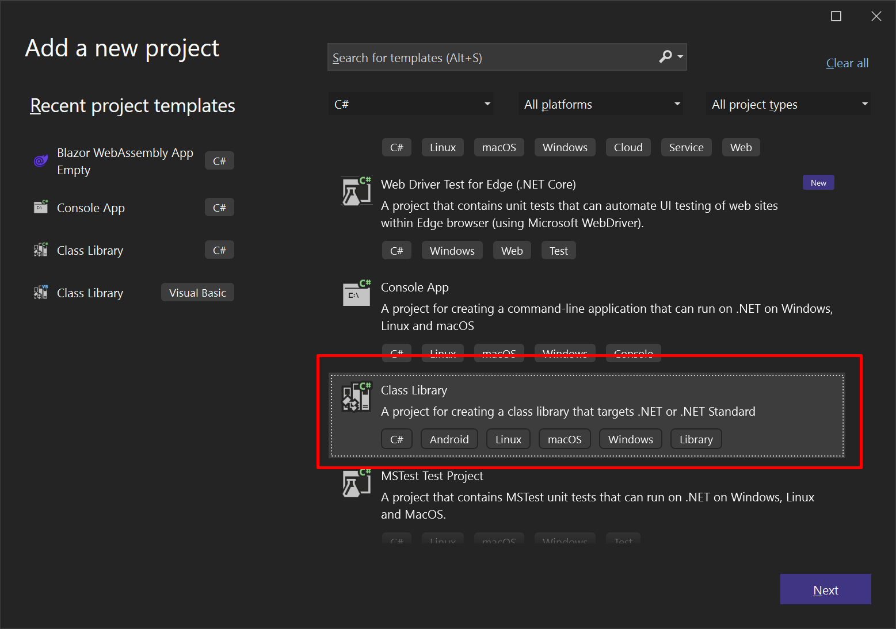

# VeloxDB + ASP.NET + Blazor WASM

## Introduction

At long last, I get to unleash my greatest dream upon the world: my very own web stack. In a sea of LAMPs and MERNs and countless other acronyms, it's finally my turn to make my mark. 
This stack is unlike any other for it is built upon the foundation of a single language: C#. From front-end to back-end, from database to the code itself, C# shall be the thread that binds all together.

In this guide, I'll walk you through building a simple web application using the VAB stack. For the sake of convenience, I will refer to the full stack as VAB, but feel free to suggest a more fitting name in the comments.

## What is VAB? 

The VAB stack is a tool for crafting modern, high-performing web applications. To understand the stack, let's examine each of its components and the role they play.

Blazor WASM is Microsoft's framework for writing web application frontends in C#. With Blazor WASM, the C# code is compiled to WebAssembly and actually executed in the browser – a truly remarkable feat. In our web app, we will leverage Blazor WASM to build the client-side portion of the application, eliminating the need for JavaScript.

VeloxDB is a new object-oriented database. Instead of using SQL, you use C# to create models and query data. It has a similar feel to using an ORM, but with the added bonus of exceptional speed. I am proud to say that I am one of the authors of VeloxDB. If you want to learn more about VeloxDB, be sure to check out my [article](https://dev.to/defufna/introducing-veloxdb-26j1) on the subject. In our web app, we will use VeloxDB as our persistence layer and also implement our business logic within VeloxDB.

Finally, ASP.NET Core is Microsoft's solution for building web applications using .NET. Unlike Blazor WASM, ASP.NET Core operates on the server side. In our web app, we will use ASP.NET Core mainly to expose our VeloxDB operations to the client.

## Getting Started

To get started, you'll need Microsoft .NET 7 installed. You can use any IDE of your choice, whether it be Visual Studio, VSCode, or something else entirely. This tutorial will primarily utilize Visual Studio.

With your environment prepared, it's time to start creating projects. The tutorial project can be found on [GitHub](https://github.com/defufna/vabApp/). Each step of the tutorial is committed as an individual commit within the repository, which serves as a handy reference in case you encounter any difficulties.

## Creating Projects

We will begin by creating a new Blazor WASM project. Fire up Visual Studio and navigate to the `New Project` dialog. From there, select the `Blazor WebAssembly Empty` template and click `Next`.


Now, enter a name for your project, such as "vabApp", and click `Next` once again.

In the `Additional Information` section, make sure to check the ASP.NET Core Hosted checkbox.


This will cause Visual Studio to generate both a Blazor WebAssembly project and an ASP.NET Core project, which will serve as the host for your Blazor app and API. If you neglect to check this box, you will only receive a Blazor WebAssembly project.

If you're utilizing the dotnet console tool, you can easily create a solution with the following command: 
`dotnet new blazorwasm-empty --hosted -o vabApp`

Now you should have a solution containing the following projects:

 - vabApp.Client - This is where the Blazor WASM project resides and serves as the client.
 - vabApp.Server - The ASP.NET server project.
 - vabApp.Shared - A shared ClassLibrary, where you can place code that will be utilized by both the client and server.

To test your app, simply hit F5 and run. You should be presented with something similar to the following:


Given that we're building a VeloxDB app, it's important to note that our architecture is a bit different from the norm. VeloxDB plays a larger role than a traditional database, while ASP.NET Server has a more limited role. To reflect this, we will rename vabApp.Server to vabApp.WebAPI. Keep in mind, this will only change the name of the .csproj file, leaving the folder names intact. For consistency's sake, I suggest renaming the folder from "vabApp\Server" to "vabApp\WebAPI" and then removing the project and re-adding it to the solution.

Next, let's create another class library project and name it "Server". Once created, I recommend renaming it to "vabApp.Server" to maintain consistency with the other projects in the solution. This project will house our model and business logic.



At this point, your solution should look similar to this:


Before proceeding, open the properties for vabApp.Server and under `Build`, set the `Platform target` to `x64`.

 


We must now add the appropriate references to our projects. To add NuGet references to "vabApp.WebAPI", follow these steps:
1. Right-click on the project in the `Solution Explorer` and select `Manage NuGet Packages`.
2. In the NuGet Package Manager window, select the `Browse` tab.
3. Search for "VeloxDB.Protocol" and click on it.
4. Select the latest version and click the `Install` button. 
5. Repeat the steps for "VeloxDB.AspNet" and "Swashbuckle.AspNetCore".

For "vabApp.Server", follow these steps:
1. Add references to VeloxDB and VeloxDB.Protocol NuGet packages.
2. To add a project reference, right-click on the project in the `Solution Explorer` and select `Add` then `Project Reference`.
3. In the `Reference Manager` window, select `Projects` from the left-hand side.
4. Check the box next to "vabApp.Shared" and click `OK`.

The VeloxDB package provides the core functionality for working with the VeloxDB database. The VeloxDB.Protocol package provides the necessary protocols for connecting to the VeloxDB server. Finally, the vabApp.Shared project reference provides the necessary shared code between projects.

To run the vabApp.Server project, follow these steps:
1. Right-click on the "vabApp.Server" project in the Solution Explorer.
2. Select `Debug` and then click `Start without debugging`.


This will start VeloxDB with an empty model.

## Creating the Model

For our demonstration, we will be constructing a straightforward contacts app. This will consist of a single class model with basic information about a contact.

To get started, add a file named "Contact.cs" to the "vabApp.Server" project with the following content:

```cs
using VeloxDB.ObjectInterface;

namespace vabApp.Server
{
    [DatabaseClass]
    public abstract class Contact : DatabaseObject
    {
        [DatabaseProperty]
        public abstract string FirstName { get; set; }

        [DatabaseProperty]
        public abstract string LastName { get; set; }

        [DatabaseProperty]
        public abstract string Email { get; set; }
        
        [DatabaseProperty]
        public abstract string PhoneNumber { get; set; }        

    }
}
```
You can now run the server to ensure everything is functioning properly. If it starts up without any errors, you can proceed to the next step.

## Creating CRUD API

The next step is to create and expose basic [CRUD](https://en.wikipedia.org/wiki/Create,_read,_update_and_delete) API. 

We'll start by adding a [DTO](https://en.wikipedia.org/wiki/Data_transfer_object) class for our Contact to the "vabApp.Shared" project. This DTO will be used for moving data between the Server and the WebAPI, and then again between the WebAPI and the Blazor client. To achieve this, simply create a new "Contact.cs" file within the "vabApp.Shared" project and include the following content:

```cs
namespace vabApp.Shared
{
    public class Contact
    {
        public long Id { get; set; }
        public string? FirstName { get; set; }
        public string? LastName { get; set; }
        public string? Email { get; set; }
        public string? PhoneNumber { get; set; }
    }
}
```
To streamline the process of moving data between the database and DTOs, VeloxDB comes equipped with a built-in automapper. Update the "Contact" class in "vabApp.Server" as follows:
```cs
[DatabaseClass]
public abstract partial class Contact : DatabaseObject
{
    [DatabaseProperty]
    public abstract string FirstName { get; set; }

    [DatabaseProperty]
    public abstract string LastName { get; set; }

    [DatabaseProperty]
    public abstract string Email { get; set; }
        
    [DatabaseProperty]
    public abstract string PhoneNumber { get; set; }

    public partial vabApp.Shared.Contact ToDTO();
    public static partial Contact FromDTO(ObjectModel om, vabApp.Shared.Contact dto, bool allowUpdate = false);
}
```

The "Contact" class is now marked partial, and there are two new methods: ToDTO and FromDTO. The automapper source generator will fill these methods automatically.

It's now time to create our API. In "vabApp.Server", create a new class and call it "ContactsAPI". Place the following content within it:

```cs
using VeloxDB.ObjectInterface;
using VeloxDB.Protocol;
using DTO = vabApp.Shared;

namespace vabApp.Server
{
    [DbAPI]
    public class ContactsAPI
    {
        [DbAPIOperation]
        public long Add(ObjectModel om, DTO.Contact toAdd)
        {
            // Creates new contact in the database using the data in toAdd DTO
            Contact newContact = Contact.FromDTO(om, toAdd);
            return newContact.Id;
        }

        [DbAPIOperation]
        public List<DTO.Contact> GetContacts(ObjectModel om)
        {
            // Gets all contacts in the database, converts them to DTOs and returns them
            return new List<DTO.Contact>(om.GetAllObjects<Contact>().Select(c=>c.ToDTO()));
        }

        [DbAPIOperation]
        public DTO.Contact? GetContact(ObjectModel om, long id)
        {
            Contact? c = om.GetObject<Contact>(id);

            // GetObject returns null if the object does not exist in the database
            if (c == null)
                return null;

            return c.ToDTO();
        }

        [DbAPIOperation]
        public bool Update(ObjectModel om, DTO.Contact toUpdate)
        {
            // Checks if the object with given id exists in the database
            if(om.GetObject<Contact>(toUpdate.Id) == null)
                return false;

            // FromDTO can update an object if it's 3rd argument (allowUpdate) is set to true.
            // It will fetch an object from the db and update all its properties with values from the dto.
            Contact.FromDTO(om, toUpdate, true);
            return true;
        }

        [DbAPIOperation]
        public bool Delete(ObjectModel om, long id)
        {
            Contact? c = om.GetObject<Contact>(id);

            // If the object with given id does not exist in the database, return false
            if (c == null)
                return false;

            // Delete the object
            c.Delete();
            return true;
        }
    }
}
```

Here, we've defined our database operations which are now accessible through VeloxDB's protocol. We have implemented Add, Update, Delete, and Get operations, and with the aid of the comments provided, the code should be straightforward to understand.

The first argument in every database operation is [ObjectModel](https://vlxdb.com/api/VeloxDB.ObjectInterface.ObjectModel.html). [ObjectModel](https://vlxdb.com/api/VeloxDB.ObjectInterface.ObjectModel.html) is an interface that provides access to VeloxDB. It enables you to retrieve objects, create new ones, and perform queries on the indexes.

Each DbAPI operation is a database transaction. If the method completes successfully, the transaction is committed. If the method fails (an exception is thrown), the transaction is rolled back. VeloxDB is an ACID-compliant database with [strict serializability](https://jepsen.io/consistency/models/strict-serializable) guarantees. 

To ensure high performance, VeloxDB uses an internal binary protocol to access these operations. However, web browsers can only communicate using the HTTP protocol, and as VeloxDB server doesn't support HTTP, a WebAPI needs to be created to allow web clients to access VeloxDB operations.

## WebAPI

Let me start by addressing why VeloxDB doesn't have native support for a REST API. As a database engineered for maximum performance, it seemed like a waste of resources to have the database spend time parsing JSON. That's why VeloxDB only supports the most performant protocol available – our own, specifically engineered for the task. I will write a separate article on VeloxDB's RPC protocol in the future.
The additional benefits of having a separate JSON translation layer include:
 - The WebAPI layer can be easily scaled.
 - It can host simple validation logic, such as checks for input validity that don't require accessing the database.
 - VeloxDB's client library also performs batching of calls, so having a WebAPI server in front of VeloxDB would cause calls from clients to arrive in batches at VeloxDB, which would further relieve pressure on the database.

Let's create the interface for the ContactAPI in the "vabApp.WebAPI" project by creating a new class called "ContactsAPI". Copy and paste the following code into it:

```cs
using vabApp.Shared;
using VeloxDB.Client;
using VeloxDB.Protocol;

namespace vabApp.WebAPI
{
    [DbAPI(Name = "vabApp.Server.ContactsAPI")]
    public interface ContactsAPI
    {
        [DbAPIOperation]
        DatabaseTask<long> Add(Contact toAdd);

        [DbAPIOperation]
        DatabaseTask<List<Contact>> GetContacts();

        [DbAPIOperation]
        DatabaseTask<Contact?> GetContact(long id);

        [DbAPIOperation]
        DatabaseTask<bool> Update(Contact toUpdate);

        [DbAPIOperation]
        DatabaseTask<bool> Delete(long id);
    }
}
```
This is the interface of our ContactsAPI, which we will use to connect to the server. Note that ObjectModel is not present as the first argument, as it is provided by the database. Additionally, all return values are wrapped in [DatabaseTask](https://vlxdb.com/api/VeloxDB.Client.DatabaseTask-1.html). This is because we want an asynchronous interface. If we had omitted DatabaseTask, we would have a synchronous interface, which would work fine, but it's recommended to use an asynchronous interface for web applications.

I noticed while writing this tutorial that controllers for WebAPI are a real chore to write. All they do is call a method from a contract interface. To alleviate this, I created a SourceGenerator that generates controllers from DbAPI. This generator is available through the "VeloxDB.AspNet" NuGet package. The generator is still quite simple, but it serves its purpose for this example.

The generator identifies all the [DbAPIAttribute](https://vlxdb.com/api/VeloxDB.Protocol.DbAPIAttribute.html) interfaces in the project and generates an appropriate controller for each. You can use attributes to guide the generator on what attributes to include in the generated code. If you want to write the controller yourself, you can use the [DoNotGenerateControllerAttribute](https://vlxdb.com/api/VeloxDB.AspNet.DoNotGenerateControllerAttribute.html) to prevent the generator from generating a controller for a particular interface. This can be useful if you want to do more with the controller, like validate arguments.

Let's first decorate our interface with ASP.NET attributes to better specify the desired controller. Update the interface as follows:

```cs
using Microsoft.AspNetCore.Mvc;
using vabApp.Shared;
using VeloxDB.AspNet;
using VeloxDB.Client;
using VeloxDB.Protocol;

namespace vabApp.WebAPI
{
    [Forward(typeof(RouteAttribute), "/api/Contacts/[action]")]
    [DbAPI(Name = "vabApp.Server.ContactsAPI")]
    public interface ContactsAPI
    {

        [DbAPIOperation]
        DatabaseTask<long> Add(Contact toAdd);

        [HttpGet]
        [DbAPIOperation]
        DatabaseTask<List<Contact>> GetContacts();

        [HttpGet]
        [DbAPIOperation]
        DatabaseTask<Contact?> GetContact(long id);

        [DbAPIOperation]
        DatabaseTask<bool> Update(Contact toUpdate);

        [HttpDelete]
        [DbAPIOperation]
        DatabaseTask<bool> Delete(long id);
    }
}
```

Pay heed to the Forward attribute – this attribute enables you to pass along any attribute to the generated controller. This is critical, as ASP.NET attributes cannot be applied to an interface. On the other hand, method attributes do not have these limitations, so we utilize them directly.

In the vabApp.Shared project, add a file named LongToStringConverter.cs with the following content:

```cs
using System.Text.Json.Serialization;
using System.Text.Json;

namespace vabApp.Shared
{
    public class LongToStringConverter : JsonConverter<long>
    {
        public override long Read(ref Utf8JsonReader reader, Type typeToConvert, JsonSerializerOptions options)
        {
            if (reader.TokenType == JsonTokenType.String)
            {
                return Convert.ToInt64(reader.GetString());
            }

            throw new NotSupportedException();
        }

        public override void Write(Utf8JsonWriter writer, long value, JsonSerializerOptions options)
        {
            writer.WriteStringValue(value.ToString());
        }
    }
}
```

I'll explain why we added this piece of code in a moment. Now open the Program.cs file in the vabApp.WebAPI project and modify it like this:

```cs
using Microsoft.OpenApi.Models;
using VeloxDB.AspNet.Extensions;
using vabApp.Shared;
using Microsoft.AspNetCore.Mvc.Formatters;

internal class Program
{
    private static void Main(string[] args)
    {
        var builder = WebApplication.CreateBuilder(args);

        builder.Services.AddControllersWithViews().AddJsonOptions((options) =>
        {
            options.JsonSerializerOptions.Converters.Add(new LongToStringConverter());
        });

		builder.Services.AddControllers(options =>
		{
			options.OutputFormatters.RemoveType<HttpNoContentOutputFormatter>();
		});

		builder.Services.AddRazorPages();
        builder.Services.AddSwaggerGen(options => options.MapType<long>(() => new OpenApiSchema { Type = "string" }));
        builder.Services.AddVeloxDBConnectionProvider("address=localhost:7568;");

        var app = builder.Build();

        // Configure the HTTP request pipeline.
        if (app.Environment.IsDevelopment())
        {
            app.UseWebAssemblyDebugging();
            app.UseSwagger();
            app.UseSwaggerUI();
        }
        else
        {
            // The default HSTS value is 30 days. You may want to change this for production scenarios, see https://aka.ms/aspnetcore-hsts.
            app.UseHsts();
        }

        app.UseHttpsRedirection();
        app.UseBlazorFrameworkFiles();
        app.UseStaticFiles();

        app.UseRouting();

        app.MapRazorPages();
        app.MapControllers();
        app.MapFallbackToFile("index.html");

        app.Run();
    }
}
```

There are two things we have done here. Firstly, we've registered the VeloxDB connection provider using AddVeloxDBConnectionProvider. The VeloxDBConnection provider is a simple service that provides connections to VeloxDB. Our controller leverages it to connect to VeloxDB. For this sample application, I've hardcoded the connection string, but in a real-world scenario, it would be wise to put it in a config file or user secret.

Secondly, we've updated the code to configure JSON serialization to always serialize long values as strings. JavaScript handles all numbers as double floating types, and a 64-bit integer can have more numbers than a double type can handle. To avoid truncation, we use strings for our long values.

You should now be able to run the application. Start both the vabApp.WebAPI and vabApp.Server projects. You can start the first one using a regular run, and for the second project, go to the solution explorer, right-click on the project, select `Debug`, and choose `Start Without Debugging`.

Once the server starts and your browser opens, go to the "/Swagger" address. The Swagger UI will load, and you will see our Controller API. You can now try executing these methods from the UI, and they should work. Try adding, updating, and deleting contacts.

Now that the database is running and the WebAPI is exposing its interface to the web, we can move on to the final step.

## Writing the Client

Finally, it's time to write the client. I don't want to get bogged down in too many details here – there are plenty of fantastic Blazor WebAssembly tutorials available. The primary goal of this article is to demonstrate how VeloxDB can be used in the creation of modern web apps. I opted for Blazor because I felt that its C#-based architecture is a great match for VeloxDB. But any web framework would do the trick.

With that in mind, let's tweak the Index.razor file within the vab.WebAPI project.

```cs
@page "/"
@using System.Text.Json;
@using vabApp.Shared;
@inject HttpClient Client;

<h1>Contacts</h1>

<a href="/add">Add Contact</a>

@if(message != null)
{
<p style="color:red;">
	@message
</p>
}

@if(contacts == null || contacts.Length == 0)
{
	<p>No contacts found!</p>
}
else
{
	<table>
		<thead>
			<tr>
				<th>First name</th>
				<th>Last name</th>
				<th>E-Mail</th>
				<th>Phone</th>
				<td></td>
				<td></td>
			</tr>
		</thead>

		@foreach (Contact contact in contacts)
		{			
			<tr>
				<td>@contact.FirstName</td>
				<td>@contact.LastName</td>
				<td>@contact.Email</td>
				<td>@contact.PhoneNumber</td>
				<td><a href="/Edit/@contact.Id">Edit</a></td>
				<td><a href="" @onclick="()=>Delete(contact.Id)" @onclick:preventDefault >Delete</a></td>
			</tr>
		}
	</table>
}

@code{
	private Contact[]? contacts = null;
	private string? message = null;

	JsonSerializerOptions options = new JsonSerializerOptions(JsonSerializerDefaults.Web)
	{
		Converters = { new LongToStringConverter() }
	};

	private async Task Delete(long id)
	{
		message = null;
		try
		{
			var response = await Client.DeleteAsync($"/api/Contacts/Delete?id={id}");
			response.EnsureSuccessStatusCode();
			await LoadContacts();
		}
		catch(HttpRequestException)
		{
			message = "Failed to delete contact";
		}
	}

	protected override async Task OnInitializedAsync()
	{
		await LoadContacts();
	}

	private async Task LoadContacts()
	{
		message = null;
		try
		{
			contacts = await Client.GetFromJsonAsync<Contact[]>("api/Contacts/GetContacts", options);
		}
		catch (HttpRequestException)
		{
			message = "Error fetching contacts";
		}
	}
}
```
This is a straightforward Blazor WASM page targeting a regular old WebAPI. Nothing special, just the usual suspects – fetch data, display it, catch errors. 

Up next, let's create an Add.razor file with this inside:

```cs
@page "/Add"
@using System.Text.Json;
@using vabApp.Shared;
@using Microsoft.AspNetCore.Components.Forms
@inject HttpClient Client;
@inject NavigationManager NavManager

<h1>Add Contact</h1>

@if (errorVisible)
{
	<p style="color:red;">
		Error adding contact.
	</p>
}

<EditForm Model="@contact" OnSubmit="@HandleSubmit">
	<p>
		<label>
			First Name:
			<InputText id="firstName" @bind-Value="contact.FirstName" />
		</label>
	</p>
	<p>
		<label>
			Last Name:
			<InputText id="lastName" @bind-Value="contact.LastName" />
		</label>
	</p>
	<p>
		<label>
			E-Mail
			<InputText id="email" @bind-Value="contact.Email" />
		</label>
	</p>
	<p>
		<label>
			Phone Number:
			<InputText id="phoneNumber" @bind-Value="contact.PhoneNumber" />
		</label>
	</p>
	<button type="submit">Submit</button>
</EditForm>

@code {
	private Contact contact = new();
	private bool errorVisible = false;

	JsonSerializerOptions options = new JsonSerializerOptions(JsonSerializerDefaults.Web)
	{
		Converters = { new LongToStringConverter() }
	};

	private async Task HandleSubmit()
	{
		errorVisible = false;
		try
		{
			var response = await Client.PostAsJsonAsync<Contact>("/api/Contacts/Add", contact, options);
			response.EnsureSuccessStatusCode();

			NavManager.NavigateTo("/");
		}catch(HttpRequestException)
		{
			errorVisible = true;
		}
	}
}
```

And edit.razor page:

```cs
@page "/Edit/{Id}"
@using System.Text.Json;
@using vabApp.Shared;
@using Microsoft.AspNetCore.Components.Forms
@inject HttpClient Client;
@inject NavigationManager NavManager

<h1>Edit Contact</h1>

@if (message != null)
{
	<p style="color:red;">
		@message
	</p>
}
else
{
	<EditForm Model="@contact" OnSubmit="@HandleSubmit">

		<p>
			<label>
				First Name:
				<InputText id="firstName" @bind-Value="contact.FirstName" />
			</label>
		</p>
		<p>
			<label>
				Last Name:
				<InputText id="lastName" @bind-Value="contact.LastName" />
			</label>
		</p>
		<p>
			<label>
				E-Mail
				<InputText id="email" @bind-Value="contact.Email" />
			</label>
		</p>
		<p>
			<label>
				Phone Number:
				<InputText id="phoneNumber" @bind-Value="contact.PhoneNumber" />
			</label>
		</p>
		<button type="submit">Submit</button>

	</EditForm>
}

@code {
	private Contact contact = new();
	private string? message = null;

	[Parameter] public string? Id { get; set; }

	JsonSerializerOptions options = new JsonSerializerOptions(JsonSerializerDefaults.Web)
	{
		Converters = { new LongToStringConverter() }
	};

	protected override async Task OnInitializedAsync()
	{
		if(Id == null || !long.TryParse(Id, out _))
		{
			message = "Invalid contact Id";
			return;
		}

		Contact? newContact = null;
		try
		{
			newContact = await Client.GetFromJsonAsync<Contact>($"/api/Contacts/GetContact?Id={Id}", options);
		}
		catch (HttpRequestException)
		{
			message = "Error fetching contact";
		}

		if (newContact != null)
		{
			contact = newContact;			
		}
		else
		{
			message = "Contact not found";	
		}

	}

	private async Task HandleSubmit()
	{
		message = null;
		try
		{
			var response = await Client.PostAsJsonAsync<Contact>("/api/Contacts/Update", contact, options);
			response.EnsureSuccessStatusCode();

			NavManager.NavigateTo("/");
		}catch(HttpRequestException)
		{
			message = "Error updating contact";
		}
	}
}
```

And now, it's finally time to run the app. You're looking at a basic contacts web page with the ability to create, update, or delete contacts. All in C#, from the frontend to the very heart of the database. Marvelous, isn't it?


## What's Next

VeloxDB is still in its beta phase but there's a ton of great things to come. We're talking SQL Select, Disk-based classes, Time-series classes, BTree index, Spatial index, and Full-text search. And as for the ASP.NET package, well, it's just a demo for now. But, I've got plans to add gRPC support, give you better control over controller generation, and throw in some ASP.NET features like authentication. If you want to stay in the loop, follow us on [GitHub](https://github.com/VeloxDB/VeloxDB) or [Twitter](https://twitter.com/VeloxDB).

Building a strong and supportive community around VeloxDB and VAB is a major priority for the future. I want to encourage developers to contribute their own ideas and feedback, which will play a crucial role in guiding the future direction of VeloxDB and VAB.

Ultimately, my goal is to make VeloxDB and VAB the go-to solution for building high-performance, scalable web applications using the power of C#. Stay tuned for exciting developments in the near future!

For more information, check out these helpful resources:
Website: https://www.vlxdb.com
User Guide: https://vlxdb.com/guide/introduction.html
GitHub: https://github.com/VeloxDB/VeloxDB
Twitter: https://twitter.com/VeloxDB
