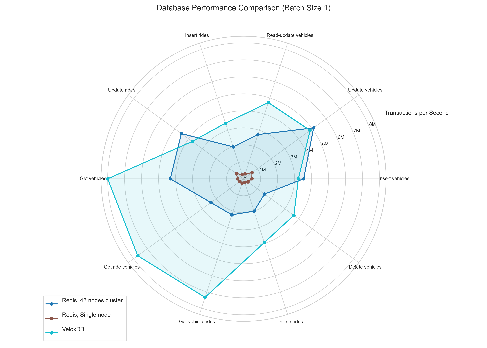
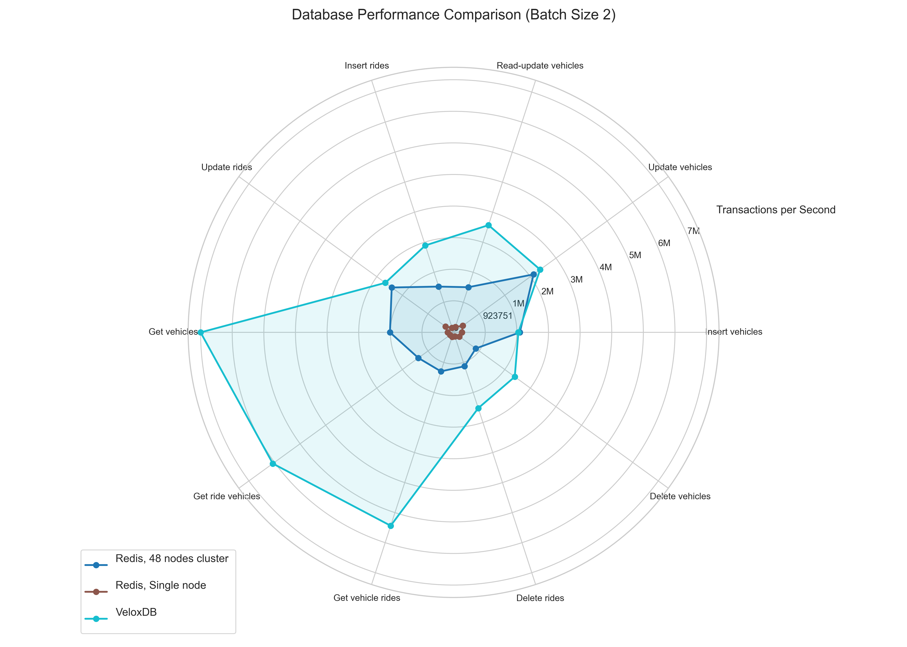
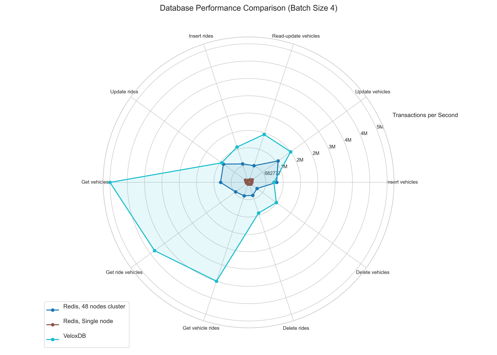

# VeloxDB vs Redis

# Introduction

During conversations, explaining VeloxDB often leads to the inevitable question: "It's fast... like Redis?" It's a fair question, given Redis's reputation for speed. But while both are in-memory optimized databases, they are fundamentally different beasts, built with distinct philosophies and for different purposes.

To demonstrate these differences, we benchmarked VeloxDB against Redis by porting our standard performance test. This post isn't just about the numbers, it examines what those figures reveal about the fundamental design choices of each database, helping you understand their respective strengths and ideal use cases.

# What is VeloxDB

VeloxDB is designed from the ground up for applications where both high performance and data correctness are non-negotiable. Think of financial trading systems, real-time inventory management in e-commerce, complex vehicle tracking, or the state management of massively multiplayer online games (MMORPGs).

Key characteristics define VeloxDB:

1.  **Object-Oriented Core:** Developers interact with data using familiar object-oriented concepts. Unlike traditional ORMs that add layers over relational databases, VeloxDB executes your OO code *directly* within the database, minimizing overhead and keeping logic close to the data. The object-oriented design was chosen for its performance benefits.

2.  **Vertical Scaling First:** While many databases achieve performance by scaling horizontally (adding more machines), this introduces the complexities of distributed systems. Achieving full ACID compliance in such environments is challenging, and the associated costs can often outweigh the benefits. As a result, many horizontally scaled databases compromise on correctness to achieve performance. VeloxDB prioritizes maximizing performance on a *single powerful node* (vertical scaling). This allows us to offer top-tier correctness guarantees without the typical distributed system trade-offs. VeloxDB supports horizontal read scaling and we have plans for horizontal write scaling, but our priority is robust single-node performance first.

3.  **Strong ACID Guarantees:** Correctness is paramount. VeloxDB is schema-full, requiring you to define your data model and constraints, much like traditional SQL databases. All data modifications happen within "Database Operations" (akin to stored procedures), which are full ACID transactions with Serializable isolation – the strongest level.

4.  **In-Memory, Persisted**: Like Redis, VeloxDB is designed for datasets that fit primarily within RAM for maximum speed. Unlike Redis, however, VeloxDB provides fully synchronous persistence: once a transaction is confirmed, the data has already been securely written to disk. This guarantees full ACID compliance and eliminates the risk of data loss due to asynchronous persistence.

# What is Redis?

Redis is a household name, an in-memory key-value store celebrated for its speed and simplicity. It started as a caching layer but quickly evolved into a versatile tool for session management, leaderboards, message brokering, real-time analytics, and more.

Key characteristics define Redis:

1.  **Key-Value Simplicity:** Interaction is typically through simple commands (SET, GET, HSET, etc.). Data structures are flexible (strings, lists, sets, hashes, streams) but fundamentally based on keys.
2.  **Horizontal Scaling Focus:** Redis is typically single-threaded per instance. While incredibly fast, a single instance can become CPU-bound on powerful machines. The standard approach to scale Redis is horizontally – running multiple instances, often in a cluster, distributing the load across them.
3.  **Schema-less Flexibility:** Data structure is defined by the application, not enforced by the database. This offers flexibility but places the burden of data integrity on the application developer.
4.  **Speed Over Strict Consistency:** While Redis offers persistence options and basic transaction-like features (MULTI/EXEC pipelines), its default guarantees prioritize availability and low latency. Persistence is asynchronous (a write confirmation means data is in Redis's memory, not necessarily safe on disk), and transaction guarantees are weaker than traditional ACID databases.

## The Benchmark

To compare them, We used our standard VeloxDB benchmark: a CRUD (Create, Read, Update, Delete) test simulating an Uber-like ride-hailing service. It models `Vehicles` and `Rides` and performs operations like:

  * Inserting new vehicles/rides.
  * Updating vehicle locations or ride statuses.
  * Deleting records.
  * Fetching related data (e.g., all rides for a vehicle).

We run these operations concurrently from multiple client threads to saturate the database and measure transaction throughput (transactions per second). The test uses varying batch sizes (1, 2, 4) – processing 1, 2, or 4 vehicles/rides per transaction – to see how performance scales with transaction complexity.

**The Challenge of Adaptation:** This benchmark *isn't* inherently Redis-friendly. Redis isn't primarily designed for complex, relational-like data structures or strict transactional guarantees across multiple keys. A direct, transactionally-pure implementation matching VeloxDB's ACID guarantees would likely use `MULTI/EXEC` heavily, potentially impacting performance significantly and not reflecting typical Redis usage patterns. To give Redis a better chance to showcase its strengths while still performing the same logical work:
  * We didn't use Redis's formal transactions (`MULTI/EXEC`). This is a crucial difference: **VeloxDB operations were fully ACID, while Redis operations were not.**
  * Data was modeled using Redis Hashes for entities and Sets for relationships.
  * Initial JSON representations were scrapped in favor of raw values in Hashes to reduce parsing overhead.
  * Keys were switched to integers for efficiency.
  * Explicit batching was implemented on the client-side.
  * Server GC was enabled on the .NET client to prevent allocation bottlenecks.

**Hardware & Setup:** The tests ran on an Azure D64lds-v6 VM (64-core Intel Xeon Platinum 8573C) running Linux. Both the database and the benchmark client ran on the same machine to minimize network latency and focus on raw database processing power.

**Single-Core vs. Cluster:** Since VeloxDB automatically utilizes all available cores, but Redis is single-threaded per instance, I tested Redis in two configurations:

1.  **Single Instance:** Represents a basic Redis setup.
2.  **Cluster:** A 48-instance Redis cluster running locally (leaving 16 cores for the client), configured to leverage the machine's multi-core nature, as recommended for CPU-bound Redis workloads.

## The results

The charts show transactions per second, higher is better.

### Batch Size 1 (Single Record per Transaction):

* **VeloxDB vs. Single-Core Redis:** As expected, VeloxDB significantly outperforms the single-core Redis instance across the board, thanks to its multi-threaded architecture.
* **VeloxDB vs. Redis Cluster:** The Redis cluster dramatically improves performance, leveraging the multiple cores. It slightly edges out VeloxDB on simple write operations (Insert Vehicle, Update Vehicle, Update Ride). However, VeloxDB maintains a substantial lead in read operations (Get Vehicle Rides, Get Ride Vehicle). Implementing ACID guarantees for read transactions is a lot simpler and has less overhead, that's why there's stark difference between read and write operations in VeloxDB. Redis on the other hand does not provide these guarantees so it doesn't suffer from this overhead. 

### Scaling with Batch Size (Batches 2 & 4):

Let's look how the perfomance scales with batch size. 

* **The Gap Widens:** As the number of records processed per transaction increases (batch size grows), VeloxDB's performance advantage, especially on reads, becomes even more pronounced.
* **Why? ACID Overhead Amortization:** Each VeloxDB transaction has a certain overhead associated with guaranteeing ACID properties. By doing more work within a single transaction (larger batch size), this fixed overhead is amortized over more operations, leading to higher overall throughput.
* **Redis's Consistency:** Since the Redis implementation bypassed strict transactional guarantees, the performance doesn't scale significantly with batch size in the same way. Its performance remains relatively flat because the overhead per logical operation is already minimal (and non-transactional).

## Conclusion

So, how does VeloxDB compare to Redis? The benchmark highlights their fundamental differences:

  * **Redis excels** at high-throughput, low-latency operations with simple data structures, where strict transactional consistency isn't critical. Its horizontal scalability makes it good for caching, session stores, leaderboards, and scenarios where eventual consistency is acceptable. It's simple, flexible, and fast for its intended use cases.

  * **VeloxDB excels** where performance *must* coexist with strong correctness guarantees and potentially complex data logic. Its performance, built-in ACID transactions, schema enforcement, and OO model make it ideal for core business logic, financial systems, real-time inventory, and complex state management where data integrity cannot be compromised. 

This benchmark was "unfair" towards both Redis and VeloxDB, because it pushed Redis outside its typical use case. Meanwhile, VeloxDB was evaluated with full ACID compliance and serializable isolation incurring performance overhead that Redis simply avoids. The "unfairness" itself is educational. It demonstrates that **performance benchmarks are only meaningful in the context of specific requirements.** Redis is often chosen for its speed, even in scenarios where its weaker consistency guarantees might be a risk. If your application demands high throughput *and* strong data integrity, a database like VeloxDB, designed for exactly that intersection, could be a more appropriate and ultimately safer choice, offering comparable or better performance (especially for complex transactions and reads) without sacrificing correctness.

You can explore the benchmark code at [Github](https://github.com/VeloxDB/VeloxDB/tree/main/Samples/Performance/CRUDPerfSample)

