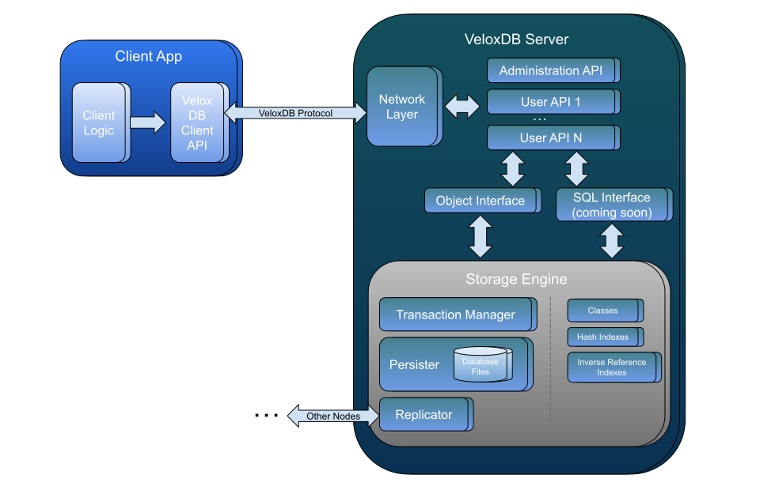
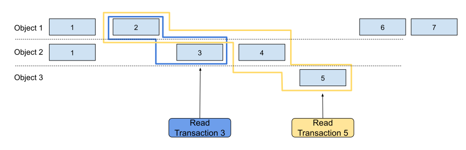
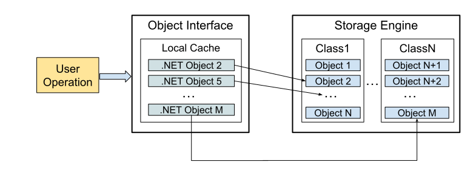

# VeloxDB architecture
This chapter provides more details about the environment in which your application logic executes as well as high level overview of the internals of the VeloxDB database. Understanding internals of the database itself, while not mandatory, will allow you to write robust, high performance code.

## Internals

Following figure gives a high level overview of VeloxDB internal architecture.

<b>Figure</b> - VeloxDB high level overview

Lets discuss the components present in the figure. Client application uses VeloxDB client API to open connections to, and interact with the database. Currently only .NET client API is supported. The client API translates object oriented method calls and method arguments into a stream of bytes that can be transferred over the network. This process is done using the built in VeloxDB Protocol serializer which is covered in more details in TODO.

On the database side, Network Layer is responsible for translating back the stream of bytes into method calls and method arguments and invoking appropriate API implementations. For each client request, Network Layer assigns a single worker thread to execute the request until completion. Users should avoid creating or using additional threads inside the API implementations. Besides hosting user defined APIs, VeloxDB defines a special administrative API that is used by the client administration tool (vlx tool) to manage the database.

The storage engine manages the actual data, providing storage for user defined classes and indexes. Classes and indexes are sotred in system memory. Currently two types of indexes are supported, hash indexes on an arbitrary set of properties as well as inverse reference indexes. We cover VeloxDB indexes in TODO. Transaction manager provides transactional writes and reads to the database. VeloxDB transactions are covered in the following sections of this chapter. Transaction Manager relies on the Persister for transaction durability (writing all transactions to the log file). Configuring and using persistence is covered in TODO. Finally, when a database server represents a single node in a database cluster, Replicator is responsible for talking to the other nodes in the cluster and making sure that transactions get replicated. Database clusters are covered in TODO.

Interaction between the user defined APIs and the storage engine is done through the Object Interface. Object Interface represents a set of components that perform mapping from user defined .NET classes to internal data representations (and vice-versa) that the Storage Engine uses (similar to how an ORM framework works with relational databases). Besides the object oriented access to the database, users will be able to issue SQL and Linq queries in the near future.

## Automatic Id

Each user defined class in VeloxDB gets an automatically assigned 64-bit integer id. This is considered a primary key in VeloxDB and no additional keys are required (but can be defined if needed). This id is inherited from the DatabaseObject class from which all user defined classes must inherit. The id itself is composed from two parts, the class identifier and the incremental part. Storing class identifier inside an object id allows the database to quickly determine the class from a given id.

The class identifier is an internally generated unique id, assigned to each user defined class. This id is 13 bits wide, providing a range of 8192 identifiers. Part of the range is reserved for internal use by the database engine leaving 7679 ids for user defined classes (meaning no more than this many classes can be defined in a single database).

The incremental part of the id is 51 bits wide and, since the ids are never reused, this allows for 2 to the power of 51 (2251 trillion) different objects during the lifetime of the database. To put this into context, if a system continuously performs one million inserts per second it would take 71 years to exhaust the id space.

## Transactions

Transactions are an essential part of VeloxDB. Any work done inside the database is done in the context of a transaction. Whenever an API operation is invoked by the client, a transaction is created under the hood. This transaction runs until the operations is completed at which point the database either commits or rollbacks the transaction. If an operation completes without throwing an exception (to the caller), it is considered to be completed successfully and the associated transaction is committed. If, on the other hand, an exception is thrown to the caller, the transaction is rolled back. You can explicitly rollback the transaction (without throwing any exceptions) by calling TODO at which point you should no longer try to interact with the ObjectModel instance provided by the database (since it is no longer usable).

There are two types of transactions in VeloxDB, read transactions and read-write transactions. What type of transactions is created is determined by the value of the OperationType property of the DbAPIOperationAttribute. Read transactions are limited to only being able to read the data from the database and attempts to modify the data inside a read transaction will result in an exception being thrown. Read-write transactions, on the other hand, can both read and modify the data, without any limitations (like, for example, requiring that all the reads are executed before all the writes).

Transactions in VeloxDB are ACID. ACID is an acronym for certain guarantees provided by the database regarding transaction execution. Specifically:
* **Atomicity** - All modifications performed during the transaction are either all applied to the database or all aborted. Modifications are never partially applied to the database.
* **Consistency** - Transactions always start from a valid database state, and can only bring the database to another valid state. Any constraints that exist in the database, such as key uniqueness and referential integrity constraints are guaranteed to be valid after the transaction completes.
* **Isolation** - Even though transactions execute in parallel, execution of every single transaction is isolated from side effects produced by other concurrent transactions. We will talk more about isolation in a moment.
* **Durability** - Modifications performed against the database, once committed, are retained in case of a some types of failures. We say some types of failures because it is impossible to protect against any type of failure. For this reason, VeloxDB offers different levels of durability. The most basic one is offered out of the box by persisting any data modifications before committing them. VeloxDB writes all modifications to the log files using O_DIRECT flag on linux and FILE_FLAG_NO_BUFFERING flag on Windows. This essentially means that any buffering by the OS is skipped and the data is sent directly to the storage device. These flags, however, do not force the storage device to actually write the data to the persistent storage. The device is free to buffer the data in its own internal write cache. Durability can further be increased by creating a cluster where every transaction is replicated to additional nodes before being committed. Clusters are covered in chapter TODO.

>[!NOTE]
>To fully understand implications of VeloxDB durability levels you need to have a basic understanding of storage caching mechanisms. Most storage devices (rotational or SSD) have some form of a write cache (usually backed by DRAM). Once a transaction has been written to a log file it will most likely be written only to the volatile write cache of the device. To achieve high levels of durability, ensure that your storage devices provide guarantees that these write caches will be flushed to the stable storage even in the case of power outage. Examples of these are battery backed write cache RAID controllers for rotational drives and supercapacitor backed SSD drives. Due to widespread availability of these technologies, VeloxDB offers no option to force the data to the stable storage synchronously (fsync on Linux, FlushFileBuffers on Windows), given massive increase in transaction latency this would induce.

Transaction isolation might be one of the most important guarantees a database provides because it has the potential to significantly simplify reasoning in complex systems. Read-write transactions in VeloxDB always execute under strict serializability. This means that final result of execution of a set of transactions (that potentially execute in parallel) is equivalent to some serialized execution order. On top of that, modifications from any transactions that have been committed before a certain point in time are visible to any transactions that are started after that point in time. VeloxDB achieves this by detecting conflicts between transactions. Conflicts are detected continuously as the transaction operations are executed. If a conflict is detected between two transactions, one of the transactions is rolled back while the other is allowed to continue executing. Users have no control over which transaction gets rolled back. When a transaction is rolled back due to a conflict an exception of type DatabaseException is thrown. Information on how to properly handle VeloxDB exceptions is given in chapter TODO. Two transactions are considered to be in conflict if they are modifying the same object or if one transaction is modifying the data that the other transaction is reading. There are many ways to read data from VeloxDBs storage engine, each of which can cause a conflict with other transactions:
* **Read by Id** - Conflict occurs if the object with the given id is being modified by some other transaction.
* **Read from hash index** - Conflict occurs if some other transaction is inserting or deleting objects with the same key or modifying the objects that are being returned from the hash index. Consider the following example, one transaction is searching for an object with a key K, while some other transaction is updating an existing object so that it has that same key K. This is considered as a conflicting situation because the second transaction is modifying the read set of the first transaction.
* **Class scan** - This operation reads all object instances of a given class (and, optionally, inherited classes). This is similar to table scans in relational databases. If another transaction is doing inserts, deletes modifying the class being scanned, this is again considered a conflict. Class scans, inside read-write transactions, should be avoided whenever possible because of a high chance of conflicts with other transactions that modify the same class. When executing SQL/Linq queries (which will be available in the near future) you should have a solid understanding of execution plans so that you do not get unexpected class scans. Keep in mind that this is specific to read-write transactions, class scans in read transactions present no problems.

Read transactions execute under strict serializability as well, which, in case of a read-only workload, is equivalent to a snapshot isolation. This means that read transactions act as if they receive their own snapshot of an entire database. Read transactions are never blocked by other read or read-write transactions. This is achieved using an optimistic concurrency control mechanism called Multi Version Concurrency Control (MVCC). With MVCC for every object in the database, a list of versions is maintained in the database. Whenever a transaction modifies the object another version of the same object is created. Following figure demonstrates this.

<b>Figure</b> - VeloxDB object versioning

Notice the tree objects in the database, Object 1, Object 2 and Object 3, each with its own set of versions. Read-write transactions introduce new versions into the database, each transaction is assigned a commit version number in the order in which they commit. The first committed transaction get the commit version 1, the second committed transaction get the commit version 2 and so on. In the example above, Object 1 was created by the transaction that committed first, and was afterwards modified by transactions with commit versions 2, 6 abd 7. Similarly, Object 3 was created by the transaction with commit version 5 and was not modified after that. Now notice the two read transactions in the lower side of the figure, Read Transaction 3 and Read Transaction 5. The numbers in transaction names represent the last commit version that the transaction sees and determine the snapshot of the database visible to that transaction. For example Read Transaction 3 sees the commit version 3 so its snapshot of the database is composed of Object 1 and Object 2 (Object 3 did not exist on version 3). Versions of objects visible by Read Transaction 3 and 5 are marked with blue and yellow outlines respectively. Notice how, even though Object 1 was modified after version 3, Read Transaction 3 continues to see the state of the object as it was on version 3.

Obviously, versions of objects can't be maintained in the database indefinitely. Database needs to remove versions that can no longer be seen by any transaction. In the previous figure (if we assume that the Read Transaction 3 is the oldest active transaction in the database) versions 1 of objects 1 and 2 can no longer be seen by any transaction and can therefore be cleaned up. This cleaning process is performed by a component inside the database called Garbage Collector (GC). GC in VeloxDB works by collecting the versions of an object that are older than the last visible version. This is not an optimal solution. In the example above, Object 1 at version 6 is also eligible for garbage collection since no active transaction sees it, and there is a newer version of the object, version 7, so any future transactions would see the version 7, however VeloxDB currently would not collect this version since it only collects versions older than the oldest transaction. Future releases of VeloxDB might improve this, but at the moment, it is very important to try to minimize the duration of transactions. Long running transactions (in combination with heavy write rates) might significantly increase memory usage of the storage engine because GC is prevented from cleaning up older versions of objects.

## Object Interface

Object interface performs automatic mapping between .NET objects and internal objects stored inside the storage engine. Internal storage engine objects are not .NET objects, they are stored in a format more suitable for other functionalities provided by the storage engine, such as transaction isolation, persistence and replication. Following figure depicts how object interface interacts with the storage engine.

<b>Figure</b> - VeloxDB object interface

If a user operation reads an object from the database (using methods of the ObjectInterface instance provided to the operation) new .NET object is instantiated and linked to the database object inside the storage engine (as demonstrated in the figure). This newly created .NET object is extremely lightweight at this point. It does not contain any internal fields for storing object property values. Remember that all classes of the data model as well as their properties must be declared as abstract. This makes it possible for object interface to create implementations of these classes whose property getters retreive the data directly from the linked object inside the storage engine. No need to copy the data into a .NET object at this point. As long as no modifications have been performed on a given object (no setters were called), the .NET object remains in this lightweight state (regardless od the complexity of the actual model class). Also, all string properties return a reference to a .NET string object stored internally by the storage engine itself (since .NET strings are immutable and can't be modified by the user code). All this makes the object interface very efficient compared to traditional relational databases (paired with ORM frameworks) where reading an object from the database will usually cause all the columns of the corresponding table to be fetched to the client (increasing memory usage and network bandwidth).

Once an object has been read from the database, it is stored inside a local cache that is part of the ObjectInterface. Reading the same object again (with the same id) will yield the same .NET instance. There are situations where this caching behavior is unnecessary. For example, performing a read-only processing of a large number of objects where each object is likely to be accessed only once. In this case objects can be abandoned by calling the Abandon method on the object itself (this method is inherited from the DatabaseObject class). This removes the object from the local cache making it possible for .NET garbage collector to collect the object (once user code releases all the references to that object). Modified objects may not be abandoned.

Once a .NET object has been modified, object interface will assign an additional internal buffer to that object. This buffer will be used to store local modifications of the object. These modifications are not transferred to the database object at this point and are only cached locally inside the local cache. Other things are cached inside this cache as well, such as index modifications, newly created objects, etc. Even though these caching mechanisms are fully transparent to the user, care must be taken. Creating large amount of modifications inside a single database operation might lead to increased size of this internal cache which might, in some cases, degrade performance. Because of that, VeloxDB offers a possibility to flush the internal cache, writing all modifications to the storage engine, by calling the ApplyChanges method of the ObjectInterface. You can call this method as many times as needed inside a single operation but avoid overdoing it. Note, however, that calling ApplyChanges does not commit the transaction, it only flushes local modifications to the storage engine (which stores them in a more efficient way). Transaction can still be rolled back if needed.

It might be obvious at this point that each invocation of a database operation receives its own instance of ObjectInterface. VeloxDB provides no way of sharing data between different operation executions (except through the database itself). Users are discouraged from implementing these shared structures themselves (using for example static fields) because these structures won't be persisted or replicated by the storage engine and will be lost if a database is restarted or transferred to a different node in a cluster.
