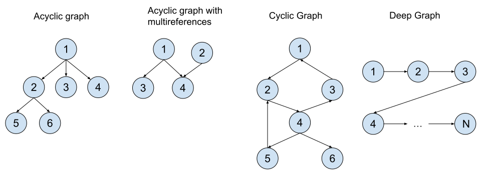
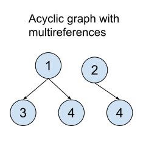

# Database APIs

VeloxDB database APIs are very similar to stored procedures in traditional relational databases. There is an ongoing debate in the relational world whether stored procedures should be used or not. Without getting ourselves into that debate, there are well documented security and performance benefits of using stored procedures over writing the data access logic in the application layer. Given that VeloxDB was designed with one primary goal in mind, to achieve extreme levels of performance, we decided to go extreme here as well, and force the users to execute their data access logic in the database. Performance aspects of this decision are even more pronounced in the VeloxDB database (compared to traditional databases) given its architecture. Following use-cases stand out:
* **Unknown read set** - A situation where the read set (a set of objects that needs to be read from the database in order to execute the logic) is not known in advance. The read set will be discovered during the execution of the operation. Typical examples are different types of graph algorithms and graph like business logic. Executing this kind of logic outside the database might produce large number of network round trip calls, significantly increasing network and CPU usage as well as the latency. VeloxDB is especially efficient in these scenarios because reading database objects does not actually cause the data to be copied from the database. .NET objects, produced this way, act more like lightweight views into the database itself.
* **Different attribute sets for different operations** - A problem that is difficult to avoid with most ORM frameworks. This situation occurs when different application operations require different sets of columns/attributes. Let's say we have two operations, GetContactInformation and DeletePost. The first one reads a user's email address and phone number while the second one deletes a post in the database, if a given user has appropriate authorization rights to do so. These two operations both use the User table, but require different columns to perform the logic. With typical ORM frameworks, a union of all the columns of the User table, used throughout the application, would get retrieved from the database. Now, this might not be important for many applications, but for performance critical ones it can significantly increase network bandwidth and CPU usage. There are no performance penalties in these situations in VeloxDB database, no matter how many properties you define in your class. Again, this is due to the fact that your logic executes inside the database and that VeloxDB doesn't perform any data copying when objects are retrieved.
* **Working with strings** - Since VeloxDB stores strings as .NET string objects, working with strings is extremely efficient inside the database itself. Reading a string from the database retrieves nothing more than a simple reference to the string object stored inside the database.
* **No additional round trips to commit the transaction** - The transaction is committed once an operation is complete. Entire operation takes only a single network round trip call.

>[!NOTE]
>If you need to perform an extremely lengthy processing of the data, consider whether it might be possible to perform the processing outside the transaction. This way you can just execute a read operation to retreive the data, and once the processing is done (outside the database), execute another write transaction to store the results. Executing lengthy write transactions significantly increases the risk of conflicts with other transactions.

Now that we have, hopefully, convinced you that executing high performance data logic needs to be done close to the actual data, let's see what capabilities are offered by the VeloxDB database and how to create and use database APIs.

## Protocol Serializer

This section describes the rules of the VeloxDB protocol serializer, allowing you to construct .NET types that can be used as input or output arguments of database operations. Following built-in .NET types are serializable by default: SByte (sbyte), Byte (byte), Int16 (short), UInt16 (ushort), Int32 (int), UInt32 (uint), Int64 (long), UInt64 (ulong), Single (float), Double (double), Decimal (decimal), Boolean (bool), String (string), DateTime, TimeSpan and Guid. Arrays and lists (List\<T\>) of serializable types are serializable as well. Given these building blocks, you are free to construct your own serializable classes and structures. Keep in mind that the protocol serializer only serializes public properties that define both getter and setter methods.

To demonstrate all this, let's create several serializable classes and structures:

```cs
public class Vehicle
{
    public long Id { get; set; }
    public string ModelName { get; set; }
    public int Year { get; set; }
    public List<long> DriverIds { get; set; }
}

public struct Point
{
    public double X { get; set; }
    public double Y { get; set; }
}

public class Ride
{
    public long Id { get; set; }
    public Vehicle Vehicle { get; set; }
    public Point[] Route { get; set; }
}
```

>[!NOTE]
>Support for other built in .NET collections (such as Dictionary\<K, V\>) might come in the future.

As you can see, building serializable types is quite simple. You do not need to use any attributes to decorate your classes and properties. However, you can use <xref:VeloxDB.Protocol.DbAPITypeAttribute> attribute on your classes and structures if you want to assign a protocol name to your type. By default each protocol type gets a default name assigned to it which is equivalent to the full name of the .NET type. When a client sends an instance of some type to the server (as a serialized stream of bytes) the server first needs to determine the type of the received object before it can start the deserialization process. The server uses this name to try to locate an appropriate server side type. If, for whatever reason, you are not able to share the server's type definition with the client code, you can use this attribute to map the name of the client's type to the name that the server expects. For example, imagine that the client had to redefine the Ride class from the previous example and that the redefined class was put in a different namespace (compared to the server's Ride class). The DbAPITypeAttribute could be used to map the client's type to the expected server name:

```cs
[DbAPIType(Name = "ServerNamespace.Ride")]
public class Ride
{
    ...
}
```

You can use the DbAPITypeAttribute on the server side as well if, for some reason, you do not want to use the default name assigned to a type.

>[!NOTE]
>Given that no attributes are needed when defining serializable classes, you might be wondering whether the same principle could have been chosen for the definition of the data model classes (which do require usage of attributes for classes and properties). The answer to that question is maybe. It would have certainly been possible to go with the same approach there as well. However, it seemed like a better approach to force the user to be explicit in the definition of the data model and avoid any mistakes that might have led to data loss or data corruption, hence the discrepancy.

### Object Graphs

When it comes to serializing object graphs there are certain aspects of the protocol serializer that you need to be aware of. Let's first define what we mean by object graph. Object graph is considered to be any set of objects that reference each other. Following figure depicts some interesting cases from the standpoint of the protocol serializer:


<center><b>Figure</b> - Object graph types</center>
</br>

The first figure shows an acyclic graph (graph without any cycles in it) with one additional property, there are no objects that are referenced by more than on other object. This, actually, represents the most common use case when it comes to transferring object graphs over the network, and is usually the only graph type supported by many JSON serializers. This type of object graph is supported by default in VeloxDB protocol serializer.

The second figure shows, again, an acyclic graph, but now there is an object that is being referenced by more than one object (object 4 is referenced by both objects 1 and 2). The third figure shows a cyclic graph, which is a graph with at least one cycle (objects 1, 2 and 3 form a cycle). The last figure shows an acyclic graph with a potentially very high depth. All these situations present a problem for many serializers and by default VeloxDB protocol serializer will not handle these situations correctly. The first situation will serialize successfully but once deserialized will produce the situation from the following figure:

<p align="center">
  
</p>
<center><b>Figure</b> - Invalid deserialization</center>
</br>

As can be seen, object 4 was deserialized twice (it was actually serialized twice as well). Situations 3 and 4 from the previous figure will not even serialize successfully, with VeloxDB throwing a DbAPIObjectGraphDepthLimitExceededException.

VeloxDB protocol serializer **does offer** a flag to indicate that you expect these kinds of situations to occur. When this flag is used, protocol serializer will switch to a mode where it will handle any kind of graph topology and properly replicate any object graph over the network. This flag can be turned on or off on a per operation basis and you can specify whether the input data or the output data (or both) require graph support. This does come at a performance cost, however, so use it only for operations that actually require graph support. You will see how to turn on graph support in the following sections when we start defining database APIs.

### Polymorphism

VeloxDB protocol serializer fully supports polymorphism. What we mean by this is that you can send an object of a child class in place where a parent class is expected. Consider the following example:

```cs
public abstract class EntityDTO
{
    ...
}

public class PersonDTO : EntityDTO
{
    ...
}

public class LegalEntityDTO : EntityDTO
{
    ...
}

public class OrderDTO
{
    public Entity OrderedBy { get; set; }
}

[DbAPI]
public interface IOrdersContract
{
    [DbAPIOperation]
    public void InsertEntity(EntityDTO entityDTO);

    [DbAPIOperation]
    public void InsertOrder(SalesOrderDTO orderDTO);
}
```

Here, InsertEntity operation expects an Entity class object. You are free to send either a Person object or a LegalEntity object. Also, SalesOrder class references an Entity object with its OrderedBy property. You can assign any entity to that reference (Person or LegalEntity) and send the order over the network (for example in InsertEntity operation).

There is one thing to consider though. When you open a connection to a given API for the first time (connections are explained latter in this chapter) VeloxDB analyses the contract (the interface) of the API and tries to discover for each class used by the interface what classes inherit from that class. It does this because it needs to know an entire set of classes used by an API in advance before any operations are executed. VeloxDB protocol discovers these classes by analyzing all the classes defined in the same .NET assembly as the base class. In our previous example, it expects to find classes Person and LegalEntity in the same assembly where Entity class is defined. This, however, might not always be the desired way to organize your classes. In cases where an inherited class is defined in a separate assembly from the base's class assembly, VeloxDB offers another possibility. You can provide an instance of IAssemblyProvider to the ConnectionFactory class when getting the connection (details of using the ConnectionFactory are comming in the following sections):

```cs
public class CustomAssemblyProvider : IAssemblyProvider
{
    public IEnumerable<Assembly> GetAssemblies()
    {
        // Assuming Person and LegalEntity are defined in a single assembly
        yield return typeof(Person).Assembly;
    }
}
```

### Serializable exceptions

You are allowed to throw exceptions from your database operations and catch them in the client code. To define an exception type that can be propagated from a database operation to the client you need to inherit  the <xref:VeloxDB.Protocol.DbAPIErrorException> base class. All the other rules as to how to define serializable classes apply here as well. Keep in mind that built in .NET exception types (such as ArgumentException, InvalidOperationException...), if thrown inside the database operation, will not be propagated to the client. The following example defines an argument exception type that can be used inside database operations:

```cs
public class MyArgumentException : DbAPIErrorException
{
    public MyArgumentException(string message) : base(message)
    {
    }
}
```

## Contract

When creating a database API, the first thing you need to do is define its contract. An API contract tells the consumer what operations are offered by an API, how to call them and what to expect from them in return. Naturally, API contract is defined as a .NET interface. It needs to be decorated with a <xref:VeloxDB.Protocol.DbAPIAttribute> attribute. This attribute has a single property, <xref:VeloxDB.Protocol.DbAPIAttribute.Name> which defines the name of an API. When defining an API contract, this attribute is mandatory. API name must be unique among all the APIs hosted inside a single database.

An API contract should contain one or more operations, represented as methods inside the interface. These methods need to be decorated with a <xref:VeloxDB.Protocol.DbAPIOperationAttribute> attribute. This attribute has several important properties:
* <xref:VeloxDB.Protocol.DbAPIOperationAttribute.Name> - specifies the name of the database operation. If omitted, the name of the .NET method is used.
* <xref:VeloxDB.Protocol.DbAPIOperationAttribute.OperationType> - specifies whether the operation requires a read or a read-write transaction to execute. Default is read-write. It is strongly advised to mark an operation as a read operation if an operation is only ever going to read data from the database. This can yield big performance benefits.
* <xref:VeloxDB.Protocol.DbAPIOperationAttribute.ObjectGraphSupport> - specifies whether the support for arbitrary object graphs is necessary for this operation. You can specify whether graph support is needed for incoming or outgoing data (or both). Keep in mind that graph support comes with a performance penalty in serialization/deserialization so use it only for when necessary. Default value of this property is None.

>[!NOTE]
>VeloxDB protocol does not support operations with the same name, even if their contract definitions differ (different input arguments or return types). .NET on the other hand allows method definitions with the same name (method overloading). This can lead to situations where code compilation succeeds but an error is generated during runtime (either client or server side). If you use method overloading to define your operations, always use DbAPIOperationAttribute to assign a unique name to each operation.

 There are certain restrictions when it comes to defining a contract of a database operation: 
 * Each operation can only have, at most, a single result value, the return value of the method (void return type is valid as well). Out and ref parameters are not allowed.
 * There can be no more than eight input arguments to each operation.
 * All input and output types need to be serializable according to the VeloxDB protocol serializer rules (discussed previously).

.NET interfaces, representing API contracts, are directly used by the client applications to execute database operations. The interface itself is not necessary to implement the contract on the server side (as you will shortly see) however, serializable classes used by the contract are required by the server side code. For this reason it is recommended to define API contracts as well as all additional serializable classes in a separate assembly, or assemblies, so that you can share these assemblies with the clients consuming the API. Alternative for this is to redefine the contract (and all the classes) on the client in which case you have to make sure to keep the two in sync when the server API changes (more detail on api updates is given in chapter [Model and API Update](model_api_update.md)).

You can define asynchronous operations inside an API contract. To define asynchronous operations specify a return type of <xref:VeloxDB.Client.DatabaseTask> or <xref:VeloxDB.Client.DatabaseTask`1> (use the first type if no return value is needed). Both of these types can be awaited. Let's now define an API contract for the sales-orders database we defined in the previous chapter:

```cs
[DbAPI(Name = "OrderManagementSystem")]
public interface IOrderManagementSystem
{
	[DbAPIOperation]
	DatabaseTask CreatePerson(PersonDTO person);

	[DbAPIOperation]
	DatabaseTask DeletePerson(long id);

	[DbAPIOperation(OperationType = DbAPIOperationType.Read)]
	DatabaseTask<PersonWithConnectionsDTO?> GetPerson(long id, bool getConnections);

	[DbAPIOperation(OperationType = DbAPIOperationType.Read)]
	DatabaseTask<PersonDTO[]> GetPersonsByName(string firstName, string lastName);

	[DbAPIOperation]
	DatabaseTask AddConnection(long id, long connectionId);

	[DbAPIOperation]
	DatabaseTask CreateOrder(OrderDTO orderData);

	[DbAPIOperation]
	DatabaseTask AddProductToOrder(long orderId, long productId);

	[DbAPIOperation(OperationType = DbAPIOperationType.Read)]
	DatabaseTask<ProductDTO[]> GetProductsFromConnections(long id, int depth, DateTime @from);
}
```

We are not providing here a full set of operations that an order management system would require just a subset that demonstrates the capabilities of the database. Most operations are self explanatory. GetProductsFromConnections operation retrieves a list of products purchased by all connections (friends) of a given entity (up to a given depth) starting from a given time point.

DTO classes used by the contract represent over-the-wire classes used to transfer the data to and from your database APIs. You may not use data model classes in the contract definition. It would not be a good idea to make your data model classes public by exposing them to the API consumers anyways. By separating the two, you are free to evolve your API contracts and data models independently of one another. These are the definitions of the DTO classes from the previous contract:

```cs
public class DatabaseObjectDTO
{
    public long Id { get; set; }
}

public abstract class EntityDTO : DatabaseObjectDTO
{
	public string UserName { get; set; }
	public string Email { get; set; }
	public string ShippingAddress { get; set; }
	public double CreditAmount { get; set; }
	public DateTime LastLoginTime { get; set; }
	public long[]? ConnectionsIds { get; set; }

	public EntityDTO()
	{
		UserName = null!;
		Email = null!;
		ShippingAddress = null!;
	}
}

public class LegalEntityDTO : EntityDTO
{
    public string Name { get; set; }
    public long TaxNumber { get; set; }
    public LegalEntityType Type { get; set; }

    public LegalEntityDTO()
	{
		Name = null!;
	}
}

public class PersonDTO : EntityDTO
{
    public DateTime DateOfBirth { get; set; }
    public string FirstName { get; set; }
    public string LastName { get; set; }

    public PersonDTO()
	{
		FirstName = null!;
		LastName = null!;
	}
}

public class PersonWithConnectionsDTO : EntityDTO
{
	public DateTime DateOfBirth { get; set; }
	public string FirstName { get; set; }
	public string LastName { get; set; }
	public EntityDTO[] Connections { get; set; }

	public PersonWithConnectionsDTO()
	{
		FirstName = null!;
		LastName = null!;
		Connections = null!;
	}
}

public class OrderDTO : DatabaseObjectDTO
{
	public OrderStatus Status { get; set; }
	public DateTime CompletionTime { get; set; }
	public long OrderedById { get; set; }
	public long[]? ProductIds { get; set; }
}

public class ProductDTO
{
	public string Name { get; set; }
	public string Description { get; set; }

	public ProductDTO()
	{
		Name = null!;
		Description = null!;
	}
}
```

>[!NOTE]
>We are using the same enumeration types as the ones used in the data model. It is recommended to share the enumeration types between the data model and API contracts.

## API Implementation

An API is implemented by defining a .NET class that implements every single operation defined by the contract (interface). The class needs to be decorated with the DbAPIAttribute attribute, the same attribute used to decorate the API contract interface. The Name property of this attribute can be used to assign a name to the API. The default API name is the full .NET name of the implementing class. Keep in mind that the name specified on the contract interface and the name specified on the implementation class need to match. We strongly advise you to use the Name property, both on the contract interface as well as the implementing class, to assign the name to an API. This way you decouple your public interface from the implementation details, allowing you, for example, to rename the implementing class without breaking the contract.

Methods that implement contract operations need to have the same signature as the corresponding methods in the contract with an additional parameter of type ObjectModel inserted as the first parameter. Following code demonstrates how to create an implementation of our order management contract from the previous section:

```cs
[DbAPI(Name = "OrderManagementSystem")]
public class OrderManagementSystem
{
    [DbAPIOperation]
    public void CreatePerson(ObjectModel objectModel, PersonDTO personData)
    {
        ...
    }

    [DbAPIOperation]
    public void DeletePerson(ObjectModel objectModel, long id)
    {
        ...
    }

    [DbAPIOperation(OperationType = DbAPIOperationType.Read)]
    public PersonWithConnectionsDTO? GetPerson(ObjectModel objectModel, long id, bool getConnections)
    {
        ...
    }

    [DbAPIOperation(OperationType = DbAPIOperationType.Read)]
    public PersonDTO[] GetPersonsByName(ObjectModel objectModel, string firstName, string lastName)
    {
        ...
    }

    [DbAPIOperation]
    public void AddConnection(ObjectModel objectModel, long id, long connectionId)
    {
        ...
    }

    [DbAPIOperation]
    public DatabaseTask CreateOrder(ObjectModel objectModel, OrderDTO orderData)
    {
        ...
    }

    [DbAPIOperation]
    public void AddProductToOrder(ObjectModel objectModel, long orderId, long productId)
    {
        ...
    }

    [DbAPIOperation(OperationType = DbAPIOperationType.Read)]
    public ProductDTO[] GetProductsFromConnections(ObjectModel objectModel, long id, int depth, DateTime @from)
    {
        ...
    }
}
```

Each operation needs to be decorated with DbAPIOperation attribute (with the same parameters as specified in the contract). Also, API method implementations must not be async. Instead of returning DatabaseTask and DatabaseTask\<T\> (as was done in the contract interface), you should replace them with void and T respectively.

## ObjectModel

All interactions with the database, inside the database operation, are done through the <xref:VeloxDB.ObjectInterface.ObjectModel> instance provided as the first parameter of each operation. Following are some of the most used methods and properties of ObjectModel class:

* <xref:VeloxDB.ObjectInterface.ObjectModel.GetObject*> - Gets the object from the database. If the object is not found, null is returned.
* <xref:VeloxDB.ObjectInterface.ObjectModel.CreateObject*> - Creates a new object of a given type in the database and returns a reference to that object.
* <xref:VeloxDB.ObjectInterface.ObjectModel.GetAllObjects*> - Provides iteration through all objects of a given type (including inherited types). This operation executes a class scan inside the database, which should be avoided inside read-write transactions, if possible.
* <xref:VeloxDB.ObjectInterface.ObjectModel.CreateObject*> - Creates a new object of a given type in the database and returns a reference to that object.
* <xref:VeloxDB.ObjectInterface.ObjectModel.GetHashIndex``2(System.String)> - Retrieves a hash index reader for a given hash index name. The hash index must have a single property as a key.
* <xref:VeloxDB.ObjectInterface.ObjectModel.GetHashIndex``3(System.String)> - Retrieves a hash index reader for a given hash index name. The hash index must have two properties as a key.
* <xref:VeloxDB.ObjectInterface.ObjectModel.GetHashIndex``4(System.String)> - Retrieves a hash index reader for a given hash index name. The hash index must have three properties as a key.
* <xref:VeloxDB.ObjectInterface.ObjectModel.GetHashIndex``5(System.String)> - Retrieves a hash index reader for a given hash index name. The hash index must have four properties as a key.
* <xref:VeloxDB.ObjectInterface.ObjectModel.ApplyChanges> - Applies all buffered modifications to the engine. This can be useful for transactions that modify large number of objects. Note that this does not commit the transaction associated with the ObjectModel instance, it just pushes the modifications from the ObjectModel to the storage engine where these are stored in a more optimal format.
* <xref:VeloxDB.ObjectInterface.ObjectModel.Rollback> - Rolls back the transaction associated with the ObjectModel instance, effectively discarding all the changes that were performed in the operation. ObjectModel instance is no longer usable after calling this method.

Note that there is no Commit method on the ObjectModel. Transaction is automatically committed once an operation has completed (provided no exceptions were thrown and Rollback was not called). Lets us now implement the CreatePerson operation in our order management system:

```cs
[DbAPIOperation]
public void CreatePerson(ObjectModel objectModel, PersonDTO personData)
{
    Person person = objectModel.CreateObject<Person>();
	person.UserName = personData.UserName;
	person.Email = personData.Email;
	person.FirstName = personData.FirstName;
	person.LastName = personData.LastName;
	person.DateOfBirth = personData.DateOfBirth;
	person.ShippingAddress= personData.ShippingAddress;
	person.Connections = new ReferenceArray<Entity>();		// No initial connections
}

[DbAPIOperation]
public void DeletePerson(ObjectModel objectModel, long id)
{
    Person? person = objectModel.GetObject<Person>(id);
    person?.Delete();
}

[DbAPIOperation(OperationType = DbAPIOperationType.Read)]
public PersonWithConnectionsDTO? GetPerson(ObjectModel objectModel, long id, bool getConnections)
{
    Person? person = objectModel.GetObject<Person>(id);
    if (person == null)
        return null;

    PersonWithConnectionsDTO personDTO = new PersonWithConnectionsDTO()
    {
        FirstName = person.FirstName,
        LastName = person.LastName,
        DateOfBirth = person.DateOfBirth,
        ShippingAddress = person.ShippingAddress,
        UserName = person.UserName,
        Email = person.Email,
    };

    if (getConnections)
    {
        personDTO.Connections = new EntityDTO[person.Connections.Count];
        for (int i = 0; i < person.Connections.Count; i++)
        {
            personDTO.Connections[i] = EntityToDTO(person.Connections[i]);
        }
    }

    return personDTO;
}

private EntityDTO EntityToDTO(Entity entity)
{
    EntityDTO entityDTO;
    if (entity is Person)
    {
        Person person = (Person)entity;
        entityDTO = new PersonDTO()
        {
            FirstName = person.FirstName,
            LastName = person.LastName,
            DateOfBirth = person.DateOfBirth
        };
    }
    else
    {
        LegalEntity legalEntity = (LegalEntity)entity;
        entityDTO = new LegalEntityDTO()
        {
            Name = legalEntity.Name,
            Type = legalEntity.Type,
            TaxNumber = legalEntity.TaxNumber
        };
    }

    entityDTO.Email = entity.Email;
    entityDTO.UserName = entity.UserName;
    entityDTO.ShippingAddress = entity.ShippingAddress;
    entityDTO.CreditAmount = entity.CreditAmount;
    entityDTO.LastLoginTime = entity.LastLoginTime;

    return entityDTO;
}
```

Creating and deleting objects from the database is simple. When an object is created, you need to populate its properties from the DTO object (or from operation parameters). Mapping between DTOs and database objects can in some scenarios be automated using an automapper. VeloxDB provides a built in automapper for these scenarios, which is discussed later in this chapter. Operation GetPerson, which executes inside a Read transaction, retrieves data for a single person and, optionally, retrieves data for all connections of that person. Again, mapping between database objects and DTOs is done manually, but you can use an automapper to automate the process.

Updating an already existing object inside the database is simple as well. You need to retrieve the object from the database and simply modify its properties. The following example adds a a new connection to an antity:

```cs
[DbAPIOperation]
public void AddConnection(ObjectModel objectModel, long id, long connectionId)
{
    Entity? entity = objectModel.GetObject<Entity>(id);
    Entity? connection = objectModel.GetObject<Entity>(connectionId);

    if (entity == null || connection == null)
    {
        objectModel.Rollback();
        return;
    }

    entity.Connections.Add(connection);
}
```

Again, besides some validations, there is nothing special here. We simply retrieve the entities from the database and create a connection between them. The remaining operations of the order management system (except the GetPersonsByName operation are provided bellow):

```cs
[DbAPIOperation]
public void CreateOrder(ObjectModel objectModel, OrderDTO orderData)
{
    Order order = objectModel.CreateObject<Order>();
    Entity? orderedBy = objectModel.GetObject<Entity>(orderData.OrderedById);

    if (orderedBy == null || orderData.ProductIds == null)
    {
        objectModel.Rollback();
        return;
    }

    ReferenceArray<Product> products = new ReferenceArray<Product>(orderData.ProductIds.Length);
    for (int i = 0; i < orderData.ProductIds.Length; i++)
    {
        Product? product = objectModel.GetObject<Product>(orderData.ProductIds[i]);
        if (product == null)
        {
            objectModel.Rollback();
            return;
        }

        products.Add(product);
    }

    order.OrderedBy = orderedBy;
    order.Products = products;
    order.Status = OrderStatus.Pending;
}

[DbAPIOperation]
public void AddProductToOrder(ObjectModel objectModel, long orderId, long productId)
{
    Order? order = objectModel.GetObject<Order>(orderId);
    Product? product = objectModel.GetObject<Product>(productId);
    if (order == null || product == null)
    {
        objectModel.Rollback();
        return;
    }

    order.Products.Add(product);
}

[DbAPIOperation(OperationType = DbAPIOperationType.Read)]
public ProductDTO[] GetProductsFromConnections(ObjectModel objectModel, long id, int depth, DateTime @from)
{
    Entity? entity = objectModel.GetObject<Entity>(id);
    if (entity == null)
        return new ProductDTO[0];

    if (entity.Connections == null)
        return new ProductDTO[0];

    HashSet<long> visitedIds = new HashSet<long>();
    visitedIds.Add(id);	// We do not want products from the given entity, only connections

    HashSet<long> productIds = new HashSet<long>();
    foreach (Entity connection in entity.AllConnections)
    {
        SearchProducts(connection, visitedIds, productIds, depth, @from);
    }

    ProductDTO[] productDTOs = new ProductDTO[productIds.Count];

    int c = 0;
    foreach (long productId in productIds)
    {
        Product product = objectModel.GetObject<Product>(productId)!;
        productDTOs[c++] = new ProductDTO()
        {
            Name = product.Name,
            Description = product.Description
        };
    }

    return productDTOs;
}

private void SearchProducts(Entity entity, HashSet<long> visitedIds, HashSet<long> productIds, int depth, DateTime @from)
{
    if (depth == 0 || visitedIds.Contains(entity.Id))
        return;

    depth--;
    visitedIds.Add(entity.Id);

    foreach (Order order in entity.Orders)
    {
        if (order.CompletionTime >= from)
        {
            foreach (Product product in order.Products)
            {
                productIds.Add(product.Id);
            }
        }
    }

    foreach (Entity connection in entity.AllConnections)
    {
        SearchProducts(connection, visitedIds, productIds, depth, @from);
    }
}
```

GetProductsFromConnections is somewhat interesting. It performs a depth-first-search through a graph of connected entities (up to a given depth) and collects all the products that were ordered after a given point in time. We use both the direct connection references as well as inverse connections reference (through the usage of AllConnections property) since connection are considered to be bidirectional. This demonstrates the ease with which you can implement graph-like business logic in VeloxDB, while achieving exceptionally high performance in doing so.

## Hash Index Usage

In the previous chapter, we defined several hash indexes for our order management data model. To use an index inside the database operation, you must first obtain a hash index reader. This is done by calling the appropriate ObjectModel.GetHashIndex method. In our case we want to retreive all users with a given first and last name. For this we will use the NameIndex defined on the Person class. This index's key contains two properties of type string so to obtain the appropriate reader we need to call ObjectModel.GetHashIndex\<Person, string, string\>. This will return an instance of the HashIndexReader\<Person, string, string\> class which we can use to query the hash index with a given key:

```cs
[DbAPIOperation(OperationType = DbAPIOperationType.Read)]
public PersonDTO[] GetPersonsByName(ObjectModel objectModel, string firstName, string lastName)
{
    HashIndexReader<Person, string, string> reader = objectModel.GetHashIndex<Person, string, string>(Person.NameIndex);
    List<Person> persons = reader.GetObjects(firstName, lastName);
    return persons.Select(x => (PersonDTO)EntityToDTO(x)).ToArray();
}
```

The GetObjects method of the reader class retrieves all the objects that have the key equal the provided key (first and last name in this example). Hash indexes can only be used to search for keys by equality. If the queried hash index has a unique constraint, you can use the GetObject method to retreive at most a single object with a given key. This method is somewhat faster than the GetObjects method because it does not need to allocate a list.

## Transaction Management

We've talked about transactions in VeloxDB in great deal throughout this guide. You've seen so far that transactions are handled implicitly by the database. Every time a database operation is called by the client, a transaction is created under the hood and associated with the operation (through the ObjectModel instance provided as the first argument of the operation implementation). This transaction ensures ACID properties for the database operation being executed, specifically, serializable isolation and atomicity. ACID properties of VeloxDB transactions are discussed in detail in [Architecture](architecture.md) chapter. Following list summarizes how transactions are used inside database operations:

* Transactions are started automatically for each database operation being executed by the client.
* You should specify what type of transaction is needed for a given operation (Read or ReadWrite) by specifying the OperationType property of the DbAPIOperationAttribute. Read transactions are significantly faster than ReadWrite transactions so you should always specify a Read transaction for operations that only read data from the database.
* ObjectModel caches all modifications you make against the database. If you expect to create large number of modifications inside a single operation, you can call ApplyChanges during execution of the operation to flush the modifications to the database. Keep in mind that this does not commit the transaction, it just flushes the local cache.
* Call ObjectModel.Rollback if you want to rollback the transaction.
* If any unhandled exception are thrown inside the operation, the transaction is automatically rolled back.
* If Rollback was not called and no exceptions were throws, transaction is automatically committed once a database operation is complete.

## API Consumption

To invoke a database API from the client application, you need to obtain the connection to the given API. Following example illustrates this:

>[!NOTE]
>When we say "client application", we do not necessarily mean front end client, but "a client of the database".

```cs
ConnectionStringParams cp = new ConnectionStringParams()
{
    BufferPoolSize = 1024 * 1024 * 8,	// 8 MB
    PoolSize = 4,
    OpenTimeout = 5000,		// 5 sec
    RetryTimeout = 5000,	// 5 sec
};

cp.AddAddress("localhost:7568");
string connectionString = cp.GenerateConnectionString()!;

IOrderManagementSystem orderManagement = ConnectionFactory.Get<IOrderManagementSystem>(connectionString);
```

As you can see, you obtain a connection to an API by calling the <xref:VeloxDB.Client.ConnectionFactory.Get`1> static method and providing the connection string. Connection string represents a collection of property values delimited by semicolon, e.g. "address=localhost:7568;open_timeout=5000;pool_size=4". Following parameters are available:
** address - Address (in the format hostname:port or ipaddress:port) of the database server. You can specify more than one address when working with a database cluster. See [Database Cluster](database_cluster.md) fir more details.

* pool_size - To avoid opening a new TCP connection every time an API connection is requested, a pool of TCP connections to the database server is kept internally. When a user requests a connection, an existing connection from the pool is used (if available). This property represents the number of TCP connections kept in the pool. The default value for this property is 4 and you will rarely need to change this. Note that this number does not limit your application to 4 concurrent requests against the database at any point in time.
* buff_pool_size - Size, in bytes, of the internal buffer pool used by each connection to send and accept data. Default value is 1 MB which is sufficient for most use cases. Note that you might need to increase this number if you regularly send and/or receive large messages or require extreme levels of performance (e.g. millions of transactions per second). This will, however, increase memory usage of your application.
* open_timeout - Timeout for opening a connection to the database, in milliseconds. If the the open attempt does not complete in this time interval, TimeoutException is thrown.
* retry_timeout - Time interval in which request against the database can be automatically retried. This is explained in more details in the section [Exceptions](database_apis.md##exception-handling).
* service_name - Service name to which the connection is being opened. Leave this property at its default value (empty string) if you want to execute database operations or query the database. By providing specific service names here, you can execute administrative tasks on the database. This is exactly how vlx client tool connects to the database.

Instead of formatting the connection string yourself, you can use the <xref:VeloxDB.Client.ConnectionStringParams> class (see previous example) to create the connection string. It is recommended to create the connection string once and store it somewhere where it will be easily accessible by different parts of your system.

Once a connection has been obtained, you simply call your database operations on it:

```cs
PersonDTO personDTO = new PersonDTO()
{
    FirstName = "John",
    LastName = "Smith",
    ShippingAddress = "John Smith, 1234 NW Bobcat Lane, St. Robert, MO 65584-5678",
    Email = "john.smith@example.com",
    UserName = "john.smith",
    DateOfBirth = new DateTime(1988, 9, 14, 0, 0, 0, DateTimeKind.Utc)
};

await orderManagement.CreatePerson(personDTO);
```

Given that CreatePerson operation is async (it returns DatabaseTask), we need to await it. This is highly recommended event if the operation has no return value (like in the case of CreatePerson operation), otherwise, any exception thrown by the operation might get silently ignored.

## Exception Handling

Proper error handling is one of the more complex topics when it comes to designing and implementing high quality software systems. There are many different exception types that can occur when working with VeloxDB, either on the client side or inside database operations. Following sections describe these exception types in details and provide guidelines on how to properly handle them.

### DatabaseException

The main exception type that the database throws when it encounters an error is <xref:VeloxDB.DatabaseException>. It has a property <xref:VeloxDB.DatabaseException.Detail> which returns an object of type <xref:VeloxDB.DatabaseErrorDetail> containing, among other things, the error code indicating the type of error that has occurred. This error code is obtained by reading the property <xref:VeloxDB.DatabaseErrorDetail.ErrorType>. We will not cover all the possible error types here (there are many), however, there are three distinct code ranges that might require different handling in user code:

* 0-5000 - These errors represent a bug in user code. An example of this is InverseReferenceNotTracked error type, which is thrown if you attempt to read inverse reference of a reference property for which inverse reference tracking has been disabled in the data model. 
* 5001-10000 - Usually represent errors that might be caused by invalid data (though this does not exclude bugs). An example of this is DeleteReferenced error type, which is thrown if you attempt to delete an object that is being referenced by another object with a reference whose DeleteTargetAction property is set to DeleteTargetAction.PreventDelete.
* \>10000 - These error codes represent a transient error inside the database. It is considered safe to retry a transaction in case an error from this range is thrown. An example of an error type from this range is Conflict error type, which indicates that the transaction attempted to read or modify an object that some other concurrent transaction is also reading or modifying.

When a DatabaseException is thrown by the database, the transaction that caused it is automatically rolled back. You should not attempt to continue the execution of a database operation after a DatabaseException is thrown.

DatabaseException can be thrown whenever you interact with the database inside your database operation. Just to give you some examples, calling Delete on a database object might fail with an error type DeleteReferenced if the object being deleted is referenced by some other object in the database. Calling ObjectModel.GetObject\<T\> might fail with an error type Conflict if an object being read is concurrently being modified by another transaction. You can, if necessary, catch the DatabaseException inside your database operation but there is rarely any value in doing so. DatabaseException, if not caught, is automatically propagated to the client executing the operation and it is our recommendation to let it propagate and handle it in client code. We will later show you the recommended way to handle errors in your database operation logic.

DatabaseException can also be thrown once a database operation is completed, because the database will try to auto-commit the transaction that was associated with the operation. If, for some reason, the commit is not possible (e.g. a failover has just occurred in a high availability cluster), the database will throw a DatabaseException. This exception will always propagate to the caller because there is no place to catch it on the server side. When committing the transaction, one specific error type can occur, the UnavailableCommitResult error type. If a client receives this error type inside the propagated DatabaseException, it can not determine whether the transaction has failed or committed successfully. This is unlike any other error code which specifically indicates that the transaction did not commit.

### Protocol Exceptions

Protocol exceptions are thrown on the client (during operation invocation) and represent either a network error or a database protocol error of some type. Following exception types belong to this group:

* <xref:VeloxDB.Networking.CommunicationObjectAbortedException> - Connection was lost during execution of the database operation. If this exception is thrown, you must not assume that the operation failed to execute inside the database. It is completely possible that the operation request was successfully sent and executed inside the database but a response failed to be delivered to the client. This is similar to the DatabaseException with an UnavailableCommitResult error type.
* System.Runtime.Serialization.TimeoutException - Connection could not be opened to the database in a given open-timeout interval. If this exception is thrown, an operation is guaranteed to have not been executed.
* <xref:VeloxDB.Protocol.DbAPIMismatchException> - Client definition of a database operation (argument types, return type...) is not compatible with the server definition of the same operation. There is en entire [chapter](model_api_update.md) dedicated to how you should handle updates of your API contracts to avoid breaking backward compatibility with the client applications.
* <xref:VeloxDB.Protocol.DbAPINotFoundException> - Requested API was not found on in the database.
* <xref:VeloxDB.Protocol.DbAPIProtocolException> - Protocol version used by the client application is not supported by the database server. This error might occur if a client software was built against a newer version of VeloxDB protocol library than the one used by the database server.
* <xref:VeloxDB.Protocol.DbAPIUnavailableException> - Requested API was not available for execution. This error can occur if a request is received by the database node (inside a database cluster) that is no longer a primary node.
* <xref:VeloxDB.Protocol.DbAPIUnknownErrorException> - An unhandled exception was thrown during execution of a database operation that is not a user-defined exception (see the next section of this chapter on details of user-defined exceptions). This essentially means that there is a bug inside the implementation of a database operation. No additional information about the exact exception being thrown inside the database operation is propagated to the client. You can check the database server trace files to see what kind of exception was thrown as well as the stack trace of the exception.
* <xref:VeloxDB.Protocol.DbAPIObjectCountLimitExceededException> - Maximum number of object being sent over the wire has been exceeded. This is currently hard coded to around 64 million objects. If you try to send mode than this many objects to (or from) a database operation, this exception is thrown.
* <xref:VeloxDB.Protocol.DbAPIObjectGraphDepthLimitExceededException> - You are trying to serialize a complex object graph and graph support has not been turned on. See [Object Graphs](database_apis.md###object-graphs) for more details.

### User-defined Exceptions

VeloxDB allows you to report user-defined errors from the database operation to the client by throwing .NET exceptions. These exceptions, when thrown inside the database operation, are propagated to the client and can be caught there for further processing. User defined exceptions must inherit from the DbAPIErrorException base class and must be serializable (according to the protocol serializer rules discussed in the previous sections). Additionally, you must explicitly designate each database operation that will allow this exception type to be propagated to the client, by using the <xref:VeloxDB.Protocol.DbAPIOperationError> attribute. Failing to do so will result in client catching an exception of type DbAPIUnknownErrorException instead of the one being thrown on the server.

We will now improve our previously defined CreatePerson operation by checking whether an entity with a give user name already exists in the database. First lets define our user defined exception type:

```cs
public class UserNameExistsException : DbAPIErrorException
{
    public UserNameExistsException()
    {
    }
}
```

Now we must decorate the AddProductToOrder operation inside the API contract, to designate that we want to propagate this exception type to the client:

```cs
[DbAPIOperation]
[DbAPIOperationError(typeof(UserNameExistsException))]
DatabaseTask CreatePerson(PersonDTO person);
```

Finally, we must decorate the CreatePerson operation inside the API implementation as well to be able to use it inside the operation:

```cs
[DbAPIOperation]
[DbAPIOperationError(typeof(ObjectNotFoundException))]
public void CreatePerson(ObjectModel objectModel, PersonDTO personData)
{
    var hr = objectModel.GetHashIndex<Entity, string>(Entity.UserNameIndex);
	if (hr.GetObject(personData.UserName) != null)
		throw new UserNameExistsException();

    Person person = objectModel.CreateObject<Person>();
	person.UserName = personData.UserName;
	person.Email = personData.Email;
	person.FirstName = personData.FirstName;
	person.LastName = personData.LastName;
	person.DateOfBirth = personData.DateOfBirth;
	person.ShippingAddress= personData.ShippingAddress;
	person.Connections = new ReferenceArray<Entity>();		// No initial connections
}
```

Notice that we do not need to explicitly rollback the transaction in case of an error. As already stated, any unhandled exception thrown from the database operation will cause automatic rollback of the transaction associated with that operation.

### Automatic request retrying

As you've seen, calling a database operations from the client can fail due to many different reasons. Some of the reasons are transient in nature and it is safe to retry an operation immediately. These include conflicts between concurrent transactions, state changes in the database cluster (failover from one node to another) and many other. Keep in mind that this is not the case in all situations. For example, receiving a CommunicationObjectAborted exception while calling a Write operation on a database is not retriable. This is because we are not certain whether an operation was executed inside the database. Repeating an already successful write operation might lead to data duplication or data corruption. Read operations, on the other hand, can always be safely retried. To avoid creating this retry logic yourself, VeloxDB provides you with a built-in retry mechanism inside the connection object that automatically retries a database operation when it is safe to do so. You can turn on this mechanism by specifying the connection string parameter retry_timeout to a value greater than zero (default is 10 sec). Connection will attempt to retry an operation during this time period. If an operation is not successfully executed during this time period, exception is propagated to the user.

### Summary

We will now try to summarize how to write robust code with VeloxDB. Most of this is fully applicable to any other code (unrelated to VeloxDB):

* You should always validate input data inside database operations. Even though a lot of validations are done internally by the database (like uniqueness constraint violations, referential integrity violations, etc...) it is still recommended that you perform these validations yourself. There are several reasons for doing so. For example, you are able to generate user-defined exceptions for each specific type of error, which will make it a lot easier to handle these errors on the client. You can populate these user-defined exceptions with meaningful data, such as user readable strings, instead of dealing with object ids (which are provided automatically when a DatabaseException is thrown).
* You should avoid catching exceptions of type DatabaseException in the database operation. If you properly validate your data before making modifications, the only reason you might get a DatabaseException is if a transient situation has prevented the database from executing your transaction or you have a bug in your code. In any case, you should just let the exception propagate to the client and handle it there.
* Wrap your calls to database operations on the client into try-catch blocks. Avoid catching the base Exception type and instead handle the following exception types: user-defined exceptions, CommunicationObjectAbortedException, DatabaseException (with special handling of UnavailableCommitResult). CommunicationObjectAbortedException and DatabaseException of type UnavailableCommitResult provide no information whether an operation was successfully executed, so handle these situations differently.
* Use auto-retry logic provided by the VeloxDB connection, by specifying some meaningful timeout for retry_timeout property. This will significantly reduce the number of errors you have to handle.

Given all this, lets try to improve our previous sample where we create a person in a database:

```cs
PersonDTO personDTO = new PersonDTO()
{
    FirstName = "John",
    LastName = "Smith",
    ShippingAddress = "John Smith, 1234 NW Bobcat Lane, St. Robert, MO 65584-5678",
    Email = "john.smith@example.com",
    UserName = "john.smith",
    DateOfBirth = new DateTime(1988, 9, 14, 0, 0, 0, DateTimeKind.Utc)
};

try
{
    await orderManagement.CreatePerson(personDTO);
}
catch (UserNameExistsException)
{
    // report back to the user that the given user name is taken
}
catch (Exception e) when (IsUnknownCommitResult(e))
{
    // report back to the user that the operation result is unkown
}
catch (DatabaseException)
{
    // report back to the user that an operation failed to execute
}
```

IsUnknownCommitResult is a helper method:

```cs
private static bool IsUnknownCommitResult(Exception e)
{
    return e is CommunicationObjectAbortedException ||
        e is DatabaseException && ((DatabaseException)e).Detail.ErrorType == DatabaseErrorType.UnavailableCommitResult);
}
```

## Automapper

Since moving data between data transfer objects (DTOs) and database objects (DBOs) is a common operation, VeloxDB comes bundled with a built-in automapper. This automapper automatically generates methods that copy data between DTOs and DBOs saving you from typing boilerplate code. The use of an automapper is optional, you can write your own object copying code, or use 3rd party automappers like [AutoMapper][1] or [Mapster][2].

Here is a brief overview of automapper features:
* Compile time - Automapper is built using C#'s [source generator][3] feature. As such it runs during compile time and mistakes are reported as compiler errors. This also has an added benefit of providing compile time validation for VeloxDB model.

* Built with VeloxDB in mind - It is aware that it is working with database objects and provides various features that are harder to achieve with generic automappers.
* Fast - Automapper is generated at compile time, it doesn't use reflection. Because of this it is as fast as if it was hand written.
* Support for references - Referenced objects can be mapped either as objects or as Ids.
* Support for circular references
* Support for deep reference graphs - When copying object graphs recursively there's a risk of encountering stack overflow if the object graph is too deep, VeloxDB automapper uses algorithm that doesn't have this problem.
* Support for polymorphism

Throughout this section, we will be using the following model:

[!code-csharp[Main](../../Samples/University/Model/University.cs)]

### Simple mapping

The core feature of the automapper is mapping properties from one object to another. VeloxDB automapper supports mapping properties from database object to DTO and from DTO to database object. Lets consider a simple DTO class for `Course` class:

[!code-csharp[Main](../../Samples/University/NoPolyNoRef/Course.cs#CourseDTO)]

The DTO contains two properties `Name` and `Id`. In order to map `Course` class to its DTO we will need to add automapper method to it. Automapper methods are partial methods added to database classes. Their body is filled in by the automapper source generator during compile time. Automapper methods that copy data to DTO must start with `To` prefix. Here is an example of method that creates `CourseDTO` from `Course` object.

```cs
public partial CourseDTO ToDTO();
```

Automapper maps properties by name and type. If DTO class has propertIes that don't map to any database property, automapper will report a warning. On the other hand DTO doesn't need to have all database class's properties.

To create a method that creates database object from DTO, create a static partial method in the database class that starts with `From`. Here is an example:

```cs
public static partial Course FromDTO(ObjectModel om, CourseDTO dto);
```

Note that the method takes <xref:VeloxDB.ObjectInterface.ObjectModel> as an argument. This is because it needs ObjectModel in order to create a new object in the database. In this case the id property is ignored and a new object is always created, if you need update functionality see[update](#update) part of this guide.

### Mapping arrays

Automapper supports mapping arrays. It has full support for both arrays of simple types and reference arrays. VeloxDB represents arrays with either <xref:VeloxDB.ObjectInterface.DatabaseArray> or <xref:VeloxDB.ObjectInterface.ReferenceArray>. These classes are not available on client side and should be mapped to either an array or [List][4]. Here is an example of `StudentDTO` DTO class that includes arrays:
[!code-csharp[Main](../../Samples/University/NoPoly/Student.cs#StudentDTO)]

If the value of array in database object is null, automapper will also produce null in the mapped object.

### Mapping references

There are two ways to map a reference property, by mapping by id, or by mapping to DTO.

The simplest approach is to map a reference by id. This is done by creating a DTO property of the same name and `long` type. The result is that referenced object's id is written into the property. When naming the DTO property in this case it is also valid to add Id or Ids suffix. Id mapping also works for arrays by mapping to `long[]` or `List<long>` types. Here is an example of `TeacherDTO` class that uses Id mapping:

[!code-csharp[Main](../../Samples/University/NoPolyNoRef/Teacher.cs#TeacherDTO)]

You can note `AssistantId` property which maps to `Assistant` property in `Teacher` class, and `TeachesIds` property which maps to `Teaches` property. If the reference points to `null`, 0 will be written to Id property. When creating database object from DTO, these ids are used to fetch objects from the database and assign them to database object. In case the object does not exist in the database, `From` method will throw an [ArgumentException][5].

Besides mapping to id, reference property can be mapped to another DTO. This enables you to easily map object graphs. In order to map a reference property to another DTO, referenced object must also contain To/From method with the same name. Here is an example of DTO with reference to another DTO:

[!code-csharp[Main](../../Samples/University/NoPoly/Teacher.cs#TeacherDTO)]

In order for this mapping to work `Course` database class must also have mapping methods with same names which map `Course` to `CourseDTO`. Here is an example of `Course` class and its DTO:

[!code-csharp[Main](../../Samples/University/NoPoly/Course.cs)]

Mapping object graphs introduces some problems. For example if you have graph like, deeply connected model, you could easily end up mapping the whole database and sending it to the client. Since this behavior is not desired, VeloxDB automapper provides a method for selecting which objects should be mapped. By default, only the object you called To method on will be mapped, objects it references will not be mapped. In order to map referenced objects to DTOs you need to call <xref:VeloxDB.ObjectInterface.DatabaseObject.Select> method on them first.
Here is an example of database operation that maps `Teacher` and all referenced courses to DTO:

[!code-csharp[Main](../../Samples/University/NoPoly/UniApi.cs#GetTeacher)]

It is also possible to map inverse references to DTOs. They are treated in the same way as reference arrays. They can be mapped to either ids or objects. Here is an example of `Course` class with inverse reference and its DTO:

[!code-csharp[Main](../../Samples/University/InvRef/Course.cs)]

>[!CAUTION]
>It is strongly advised against using a reference in both directions (direct and inverse) in DTOs. If the DTO is not consistent, for example object A points to object B but inverse reference in object B does not point back to A, mapping to database object can produce unexpected results. Mapping from database object to DTO does not have these problems.

VeloxDB automapper is aware of object identity, if two objects point to the same object, the same will be true after mapping, it will not create two objects. It is also capable of handling circular references.

### Polymorphism

Polymorphism is a key feature of object-oriented programming languages, and it is supported by VeloxDB's automapper. Polymorphism allows for objects of different types to be treated as if they were of a common base type. This can be useful in many situations, such as when working with collections of objects or when creating methods that operate on objects of multiple types.

VeloxDB automapper supports polymorphism through the use of the <xref:VeloxDB.ObjectInterface.SupportPolymorphismAttribute> attribute. This attribute is applied to methods in base classes to signal that they support polymorphism. When the <xref:VeloxDB.ObjectInterface.SupportPolymorphismAttribute> attribute is used, the automapper will generate polymorphism-aware `To` and `From` methods for the class. These methods will automatically return or create objects of the most specific type that matches the input data. Without using this attribute, attempting to add an automapper method to a subclass will result in a compilation error.

Here is an example of DTOs that use polymorphism, note that they follow the DBOs hierarchy:

[!code-csharp[Main](../../Samples/University/Poly/PolyDTO.cs#PolyDTO)]

Subclasses must have their own To or From methods that override the base class method and provide specific mapping instructions for the subclass. This allows for a DTO to be mapped to the appropriate DBO class based on the type of DTO provided.

Here is an example of `Teacher` class note its `To` and `From` methods:

[!code-csharp[Main](../../Samples/University/Poly/Teacher.cs#Teacher)]

The `ToDTO` method should not be marked as virtual because automapper generates its own internal virtual methods. To avoid generating a warning from the C# compiler due to the presence of non-virtual ToDTO methodS in both the base class and subclass, the new keyword is used in the subclass's methods to explicitly indicate that they are intended to override the base class's methods. Since these methods only call into internal virtual methods, proper polymorphic behavior is still achieved.

### Update

By default `From` method ignores Id field in DTO and always creates a new object. However, the `From` method can have an additional `allowUpdate` boolean parameter that tells it to operate in update mode. In update mode, if the DTO object has an `Id` field, the `From` method will use it to fetch the corresponding object from the database. The object that is fetched will then have its fields updated by overwriting them with the fields provided in the DTO. Any fields that are not defined in the DTO will be skipped. If the object with the given Id does not exist, an ArgumentException will be thrown. If the Id is set to 0, then a new object will be created.

Here is an example of FromDTO method with `allowUpdate` parameter:

```cs
public static partial Course FromDTO(ObjectModel om, CourseDTO dto, bool allowUpdate);
```

There are some pitfalls that you should watch out for when using update.

One pitfall to watch out for when using the update feature in VeloxDB automapper is that updates are performed on the entire object, not just individual fields. This means that if two users are updating different fields of the same object simultaneously, one user's changes could potentially overwrite the other user's changes. This can lead to data loss or inconsistencies.

Another pitfall to watch out for is that it will also update any referenced objects if they are modeled as objects in the DTO. This can lead to unintended changes to related objects if the user is not careful.

For example, if a `Course` object has a reference to a `Teacher` object, and the `CourseDTO` contains a `TeacherDTO` object, then the update feature will update both the `Course` object and the `Teacher` object with the data from the DTO. This can be undesirable if the user only wanted to update the Course object and not the Teacher object.

To avoid this pitfall, it is recommended to use DTOs that model references to other objects using only the Id field, rather than using objects. This way, the update feature will only update the object that is being updated, and will not affect any related objects. This can help prevent unintended changes and improve the reliability and predictability of the update feature.

Because of all these pitfalls it is important to use update functionality with great care.

[1]: https://automapper.org/
[2]: https://github.com/MapsterMapper/Mapster
[3]: https://learn.microsoft.com/en-us/dotnet/csharp/roslyn-sdk/source-generators-overview
[4]: https://learn.microsoft.com/en-us/dotnet/api/system.collections.generic.list-1
[5]: https://learn.microsoft.com/en-us/dotnet/api/system.argumentexception
