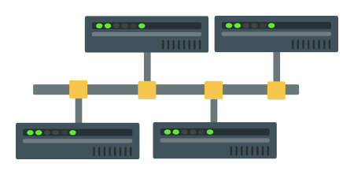

    
   
        <h1 class="vlxfont">VeloxDB</h1>
        
<em>V&#x0113;l&#x014D;x /&#x02C8;we&#x02D0;.lo&#x02D0;ks/ - quick, fast, rapid, speedy</em>

        
Fast. Cross-platform. Open source.

        
An object oriented database for building next generation solutions with .NET and C#.

        

        

        

        

        

            <a class="btn btn-default" href="guide/getting_started.md">Get Started</a>
            <a class="btn btn-default" href="download.md">Download</a>
            
To learn more. Visit the <a href="guide/introduction.md">VeloxDB Documentation</a>
            

        

    

    

    

    

        

            
        

        

            <h2 class="display-6">What is VeloxDB?</h2>
            
VeloxDB is a high performance, in-memory, object oriented database. If you need exceptionally
                high transaction throughput, but want to keep costs under control, this might be the ideal solution for you.

            
<a class="btn btn-default" role="button" href="guide/introduction.md">Want to learn more</a>

        

    

    

    

    

    

    

        

            
        

        

            <h2 class="display-6">Easy to Use</h2>
            
Write simple object oriented code without performance penalties of traditional ORM frameworks.
                Handle complex data models and business logic with ease.

            
<a class="btn btn-default" role="button"
                    href="guide/getting_started.md">Get started right now</a>

        

    

    

    

    

    

    

        

            
        

        

            <h2 class="display-6">Built for Performance</h2>
            
2.5 million write transactions per second, 8 million read transactions per second, all that on 16 cores/32 threads. Ideal for graph workloads, financial processing, IoT and edge computing, industrial and control systems, you name it.

            
<a class="btn btn-default" role="button"
                    href="guide/introduction.md#performance">See our
                    performance claims</a>

        

    

    

    

    

    

    

        

            
        

        

            <h2 class="display-6">Cross platform</h2>
            
Supports Linux, Windows and MacOS (MacOS for development only). Simple to configure and run on
                any
                platform.

        

    

    

    

    

    

    

        

            
        

        

            <h2 class="display-6">Fully Transactional</h2>
            
ACID compliant with guaranteeed strict transaction serializability, in any conditions. Stop
                thinking
                about data consistency and start focusing on your application logic.

            
<a class="btn btn-default" role="button"
                    href="guide/architecture.md#transactions">See our
                    transactional guarantees</a>

        

    

    

    

    

    

    

        

            
        

        

            <h2 class="display-6">Open Source</h2>
            
Community version of VeloxDB is open source. It features most of the VeloxDB functionality
                without
                any limitations on performance or database size.

            
<a class="btn btn-default" role="button" href="https://github.com/VeloxDB/VeloxDB">Visit our
                    github page</a>

        

    

    

    

    

    

    

        

            
        

        

            <h2 class="display-6">Cluster Support*</h2>
            
High availability for writes, scale-out for reads. Ideal for critical systems that need to
                guarantee
                high levels of availability while maintaining exceptional performance.

            
<small><em>*Not available in Community Edition.</em></small>

        

    

    

    

    

    

    

    

